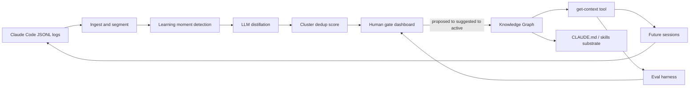

# PRAXIS

**Self-improving knowledge loop for Claude Code agents.**

[](pyproject.toml)
[](frontend-react/README.md)
[](session-capture/README.md)
[](docs/integration/candidate-api-v1.md)

Claude Code's auto-memory saves a few notes between sessions — but it's an unverified black box: no human approval, no deduplication, no measurement. **PRAXIS** mines the full JSONL session logs the agent already produces, distills durable lessons, runs them through a confidence score and human-approval gate, and injects only promoted knowledge into future sessions — so the agent provably stops relearning the same things and gets better over time.

> **Memory vs. knowledge.** Auto-memory captures scattered, episodic notes. PRAXIS produces generalized, deduplicated, confidence-scored, human-approved, measured knowledge with full provenance.

**Current remote:** [GitHub — Antonelli-Tech-Solutions/praxis](https://github.com/Antonelli-Tech-Solutions/praxis)
**Original project history:** [GitLab — monicapeters/praxis](https://labs.gauntletai.com/monicapeters/praxis)
**Architecture source of truth:** [docs/plans/PRAXIS_Project_Plan.html](docs/plans/PRAXIS_Project_Plan.html)

---

## Table of contents

- [The loop](#the-loop)
- [Problem](#problem)
- [Current implementation state](#current-implementation-state)
- [Active review and demo gates](#active-review-and-demo-gates)
- [MVP scope](#mvp-scope)
- [Success criteria](#success-criteria)
- [Team & pillars](#team--pillars)
- [Demo timeline](#demo-timeline)
- [Repository layout](#repository-layout)
- [Prerequisites](#prerequisites)
- [Quick start](#quick-start)
- [Configuration](#configuration)
- [Testing](#testing)
- [Prove dashboard graph ingest uses the eval spine](#prove-dashboard-graph-ingest-uses-the-eval-spine)
- [Documentation](#documentation)
- [Contributing](#contributing)
- [License](#license)
- [Changelog](#changelog)

---

## Project History

The original Praxis repository and its pre-migration commit history—including contributions—are preserved at [labs.gauntletai.com/monicapeters/praxis](https://labs.gauntletai.com/monicapeters/praxis) for provenance and attribution.

## The loop

```text
raw logs → extract candidate lessons → consolidate/dedup/generalize → confidence score
         → [human approval gate] → Knowledge Graph → get-context tool → future sessions
         → measure improvement → repeat
```



---

## Problem

Coding agents are less amnesiac than they used to be, but durable knowledge still lives in the gaps:

- **No quality gate** — save decisions are opaque; wrong patterns can be memorized from one-off mistakes.
- **No dedup, decay, or conflict resolution** — stale and contradictory notes coexist indefinitely.
- **No measurement** — nothing verifies a saved memory actually helped a later session.
- **Per-repository only** — nothing carries across projects, models, or domains.
- **Underused raw material** — full JSONL transcripts (`~/.claude/projects/<project>/<session>.jsonl`) record every mistake, correction, and success; auto-memory skims in-flight and discards the rest.

PRAXIS treats that exhaust as a compounding asset.

---

## Current implementation state

Point-in-time snapshot as of **2026-06-22** on the dashboard branch after merging current `origin/main`. Live gap tracker: [docs/monica/PLAN_ALIGNMENT_GAP_CHECKLIST.md](docs/monica/PLAN_ALIGNMENT_GAP_CHECKLIST.md). Monica-owned completion path: [docs/monica/MONICA_COMPLETION_PATH.md](docs/monica/MONICA_COMPLETION_PATH.md).

| Area | Path | Owner | Current state |
|------|------|-------|---------------|
| React human-gate dashboard | `frontend-react/` | Monica Peters | **Demo-ready and live-API capable** — mock fixtures, live candidate API mode, row-level item refresh, candidate editor/delete, graph tab fallback, Phoenix trace detail links, and active-candidate graph ingest via `POST /insights` |
| Dashboard contract layer | `frontend/` | Monica Peters | **Shipped** — Python candidate model/provider tests and mock workflow validation against candidate-api-v1 fixtures |
| Candidate REST API | `knowledge/serve/` | Matthew Daw | **Shipped** — FastAPI routes for candidates, orgs, contradictions, `/insights`, `/context`, and fixture `/metrics`; JSON candidate store by default, Postgres-backed store when a DSN resolves |
| Auth and tenancy | `knowledge/serve/auth.py`, `knowledge/serve/orgs_store.py` | Matthew Daw | **Shipped** — Cognito JWT verification, `X-Praxis-Org` active org, org membership checks on the Postgres path, and `PRAXIS_AUTH_DISABLED=1` for local dev |
| Knowledge substrate | `knowledge/` | Matthew Daw | **Functional foundation** — in-memory/vector/Postgres graph implementations, `PromptIngestor`, `WholeFileReader`/`RetrievingReader`, write policies, OpenRouter LLM/embedder seams, and `build_trio()` wiring |
| Eval harness | `knowledge/evals/` | Dominic Antonelli | **Working and expanding** — YAML cases, deterministic checks, fake/Claude/OpenRouter runners, context-producer registry, cached/live embedder paths, and app/eval helper scripts |
| Session capture | `session-capture/` | Dominic Antonelli | **Working wrapper** — Go `claude+` PTY daemon, JSONL tailer, and DynamoDB writer |
| Cloud infra | `infra/`, `Dockerfile`, `render.yaml` | Matthew Daw | **Scaffolded/deployable** — AWS CDK for sessions, RDS/pgvector, Cognito, App Runner, CloudFront, Phoenix; Render blueprints for API and React site |
| Eval metrics endpoint | `knowledge/serve/` `GET /metrics` | Dominic Antonelli | **Fixture endpoint** — dashboard embed is wired; real batch metrics still depend on the eval pipeline output |
| CI pipeline | `.github/` | Team | **Not established as the source of truth** — current validation is manual local test/lint/build evidence |

**Integration posture:** The dashboard runs fully offline when `VITE_PRAXIS_API_BASE_URL` is unset. Live API mode uses candidate-api-v1 plus `/insights` and `/context` when the backend is graph-backed. Missing graph support is intentionally non-blocking: the dashboard promotes/updates candidates and reports graph ingest as skipped when `/insights` is unavailable or the backend has no database.

**Recent Monica integration work:** row-level refresh, active-candidate graph ingest through `/insights`, Phoenix spans links, and the documented completion path are implemented on the dashboard branch.

---

## Active review and demo gates

| Gate | Owner | Evidence path |
|------|-------|---------------|
| Green local gate | Monica | `npm test`, `npm run lint`, `npm run build`, focused Python proxy tests, and `git diff --check` |
| Timed Act 2 dashboard demo | Monica | [docs/monica/DEMO_SCRIPT.md](docs/monica/DEMO_SCRIPT.md), [docs/monica/REHEARSAL_LOG.md](docs/monica/REHEARSAL_LOG.md) |
| Accessibility evidence | Monica | [docs/monica/MONICA_COMPLETION_PATH.md](docs/monica/MONICA_COMPLETION_PATH.md) Phase 3 |
| Screenshots/video evidence | Monica | `docs/monica/screenshots/`, `docs/monica/videos/`, and rehearsal log notes |
| Live smoke | Monica + Matthew | Run only when the API exists and is safe to mutate; use [docs/monica/INTEGRATION_SMOKE.md](docs/monica/INTEGRATION_SMOKE.md) |
| Eval improvement proof | Dominic + Matthew | `knowledge/evals/` runner output and `/metrics` once real batch data replaces the fixture |

Do not mark end-to-end graph/eval proof complete from UI behavior alone. The proof needs either a graph-backed `/insights` + `/context` round trip or eval output showing an injected-knowledge improvement.

---

## MVP scope

| In scope | Out of scope |
|----------|--------------|
| Ingest + segment real Claude Code JSONL logs | Training models from scratch |
| Learning-moment detection (heuristics + LLM) | Hosted SaaS |
| LLM distillation with provenance | Non–Claude-Code agents |
| Cluster/dedup + confidence scoring | Real-time mid-session learning |
| Knowledge Graph as primary knowledge store | |
| get-context tool (session + codebase + graph → injected context) | |
| React human-gate dashboard in `frontend-react/` (`proposed → suggested → active`) | |
| Complementary injection via generated `CLAUDE.md` / skills | |
| Eval harness measuring correction rate before/after (VCS-agnostic PR/ticket replay) | |

**Implemented beyond MVP shell:** contradiction-resolution UI (dashboard); React client for Matthew API validation; FastAPI candidate API with full CRUD; Cognito JWT auth + password-gated multi-tenant orgs; pgvector graph store; AWS App Runner + CloudFront hosting (CDK).

**Stretch goals:** trained classifier for learning moments; substrate bake-off (markdown/skills vs. vector RAG vs. knowledge graph); confidence decay and re-verification; pipeline-side contradiction **detection**; cross-project knowledge.

---

## Success criteria

- **Primary metric:** ≥50% fewer user corrections on benchmark tasks vs. cold runs, with no regression in task success rate.
- **Compounding proof:** visible correction-rate curve falling across sessions.
- **Demo outcome:** point PRAXIS at a repo's logs → ranked candidate lessons with evidence in minutes → human promotes the good ones → re-run shows quantified improvement (corrections, failures, tokens, time).

---

## Team & pillars

Three Gauntlet AI Fellows, each owning one end-to-end pillar for a 9–10 day focused sprint:

| Lead | Pillar | Focus |
|------|--------|-------|
| **Matthew Daw** | ML & Knowledge Pipeline | Ingestion, learning-moment detection, LLM distillation, consolidation/dedup/scoring, knowledge graph, provenance |
| **Monica Peters** | Dashboard & Human Gate | React human-gate dashboard, Python contract layer, approval workflow, contradiction resolution UI, credibility metrics |
| **Dominic Antonelli** | Architecture, Eval & Integration | System design, eval harness, VCS-agnostic replay automation, session capture wrapper, deployment, compounding-curve proof |

Daily 15-minute syncs; all code reviewed by at least one other member before merge.

---

## Demo timeline

Sprint **Day 1 = Tuesday, June 16, 2026** (Thursday June 18 skipped). See [docs/plans/PRAXIS_Project_Plan.html](docs/plans/PRAXIS_Project_Plan.html) and Monica's [completion path](docs/monica/MONICA_COMPLETION_PATH.md) for the tracked demo plan.

**Current posture:** core dashboard and API integration surfaces exist; remaining proof work is evidence capture, live smoke only against a safe API, and real eval metric output.

| Phase | Days | Milestones |
|-------|------|------------|
| Foundation & design | 1–2 | Architecture, data contracts, dashboard shell, eval skeleton, cold-run baseline |
| Parallel core build | 3–5 | Full pipeline, human-gate UI, scoring/decay, eval replay automation |
| Integration | 6–7 | Dashboard ↔ backend API, `/insights` graph ingest, eval harness, promotion/injection proof |
| Measurement | 8 | Compounding curve, threshold tuning, edge-case polish |
| Demo & handoff | 9–10 | Live demo script, documentation, presentation practice (internal **Jun 26–27**) |
| **Gauntlet showcase** | — | **Mon Jun 29** — 10-minute live presentation |

Team freeze gates and practice evidence: [docs/monica/PLAN_ALIGNMENT_GAP_CHECKLIST.md](docs/monica/PLAN_ALIGNMENT_GAP_CHECKLIST.md), [docs/monica/MONICA_COMPLETION_PATH.md](docs/monica/MONICA_COMPLETION_PATH.md), and [docs/monica/REHEARSAL_LOG.md](docs/monica/REHEARSAL_LOG.md).

---

## Live demo (3 acts)

1. **Dumb agent** — fresh repo with deliberate quirks; agent stumbles, gets corrected; log captured.
2. **Distillation** — PRAXIS surfaces scored candidates linked to transcript lines; human promotes `suggested → active`.
3. **Smart agent** — sibling task nails quirks first try; side-by-side scoreboard plus compounding curve across a pre-run batch.

Demo script: [docs/monica/DEMO_SCRIPT.md](docs/monica/DEMO_SCRIPT.md)

---

## Repository layout

```text
praxis/
├── docs/                      # Plans, proposals, integration contracts, fixtures
│   ├── integration/           # candidate-api-v1, eval-metrics-v1, wire-up, JSON fixtures
│   ├── monica/                # Dashboard pillar — architecture, wireframes, deploy, demo
│   ├── matt/future-work/      # Post-MVP knowledge-graph eval design (parked)
│   └── plans/                 # MVP plan (mvp-plan.html)
├── .cursor/rules/             # Team Cursor rules (shared, dashboard, pipeline-eval, git-sync)
├── frontend/                  # Python contract + mock data (Monica)
│   ├── models/                # Candidate types (API contract surface)
│   ├── services/              # DataProvider, mock + API clients, contract_v1
│   ├── tests/                 # Contract fixture + mock workflow tests
│   └── mock_data.py           # Canonical fixtures — exported to React JSON
├── frontend-react/            # React Knowledge Graph dashboard (Monica)
│   ├── src/                   # Vite + TypeScript — candidate-api-v1 client
│   ├── public/mock-candidates.json
│   └── README.md              # Self-serve wire-up (VITE_* env vars)
├── knowledge/                 # Knowledge substrate + eval harness + API (Matthew & Dominic)
│   ├── knowledge_graph/       # KnowledgeGraph ABC, InMemoryGraph, VectorGraph (pgvector)
│   │   └── write_policy/      # Write steps — deduper, redactor, conflict flagger
│   ├── injestion/             # Ingestor ABC + PromptIngestor (typo'd dir, kept for now)
│   ├── graph_reader/          # WholeFileReader → Claude tool adapter
│   ├── llm/                   # LLM/embedder ABCs + OpenRouter + fake variants
│   ├── serve/                 # FastAPI candidate API — CRUD, Cognito auth, orgs, stores
│   ├── evals/                 # YAML cases, deterministic checks, Claude Code runner
│   ├── observability/         # Phoenix/OpenTelemetry tracing seam (no-op when unset)
│   ├── tests/                 # Knowledge-package unit tests
│   ├── wiring.py              # build_trio() factory
│   └── run.py                 # Debugger entry — ingest smoke + eval runner
├── session-capture/           # Go claude+ wrapper — PTY daemon + DynamoDB capture
│   └── wrapper/               # cmd/claude-plus, internal/{pty,daemon,capture,store}
├── infra/                     # AWS CDK — sessions DDB, RDS/pgvector, Cognito, App Runner, CloudFront, Phoenix
├── scripts/                   # Seed/export helpers (mock candidates, render seed)
├── Dockerfile                 # Candidate API container (App Runner / local docker)
├── run.py                     # Repo-root shim → knowledge/run.py
├── pyproject.toml             # Python 3.12+ deps (uv/pip)
├── uv.lock                    # Locked Python dependencies
└── README.md
```

> **Note:** Early plans referenced top-level `pipeline/` and `eval/` directories. Current implementations live under `knowledge/` (including `knowledge/evals/`) and `session-capture/`. API contracts are path-agnostic.

---

## Prerequisites

| Tool | Version | Used for |
|------|---------|----------|
| Python | ≥ 3.12 | Dashboard, knowledge package, eval harness |
| [uv](https://docs.astral.sh/uv/) | latest (recommended) | Dependency install and script runner |
| Go | ≥ 1.22 | Building `session-capture/wrapper` |
| Node.js | ≥ 20 | React dashboard (`frontend-react/`), AWS CDK deploy (`infra/`) |
| AWS CLI | configured | DynamoDB session capture + CDK deploy (optional — wrapper/API run without it) |
| Docker | latest | Building the candidate API container (optional — `uvicorn` works without it) |

---

## Quick start

### 1. Install Python dependencies

From the repo root:

```powershell
uv sync
```

Or with pip:

```powershell
python -m venv .venv
.\.venv\Scripts\pip install -e .
```

### 2. Run the human-gate dashboard

```powershell
cd frontend-react
npm install
npm run dev
```

Mock mode loads `public/mock-candidates.json` — no backend required. Set `VITE_PRAXIS_API_BASE_URL` in `.env.local` for Matthew's live server. See [frontend-react/README.md](frontend-react/README.md) and [docs/integration/wire-up.md](docs/integration/wire-up.md).

**Render deploy (portfolio demo):** [docs/monica/RENDER_DEPLOY.md](docs/monica/RENDER_DEPLOY.md)

### 3. Run the candidate API (optional live backend)

The FastAPI server implements the candidate-api-v1 contract plus graph-backed
`/insights` and `/context`. Data routes require a Cognito JWT and resolve the
active org from the `X-Praxis-Org` header; set `PRAXIS_AUTH_DISABLED=1` for an
offline dev principal. With no resolved Postgres DSN it uses the JSON candidate
store and skips org membership checks. Graph routes (`/insights`, `/context`)
require the Postgres-backed path and return `503` without it.

```powershell
# Local dev (offline auth, JSON store) — serves on http://localhost:8000
$env:PRAXIS_AUTH_DISABLED = "1"
uv run python -m knowledge.serve
```

Or in a container (App Runner-compatible, binds `0.0.0.0:8080`):

```powershell
docker build -t praxis-api .
docker run -p 8080:8080 -e PRAXIS_AUTH_DISABLED=1 praxis-api
```

Point the React dashboard at it via `VITE_PRAXIS_API_BASE_URL`. Cloud hosting
(AWS App Runner + CloudFront via CDK, or Render) is described in
[infra/README.md](infra/README.md) and [docs/monica/RENDER_DEPLOY.md](docs/monica/RENDER_DEPLOY.md).

### 4. Run the eval harness

Run one case offline with the fake runner:

```powershell
uv run python -m knowledge.evals.run --fake <case_id>
```

Run one case with the configured real runner:

```powershell
uv run python -m knowledge.evals.run <case_id>
```

Run the repo-root debugger entry across registered cases:

```powershell
$env:PRAXIS_EVAL_REAL = "0"   # optional alias for fake backend
uv run python run.py
```

Registered cases live in `knowledge/evals/cases/`. Results append to `knowledge/evals/results/`.

### 5. Build session capture (optional)

```powershell
# Deploy CDK stacks (sessions DDB, RDS/pgvector KG, Cognito, App Runner, CloudFront, Phoenix)
cd infra
npm install
npm run deploy            # all stacks (the website deploys via CI — .github/workflows/deploy.yml)
# Knowledge-graph RDS setup: docs/monica/RDS_KG_DEPLOY.md

# Build claude+ wrapper
cd ..\session-capture\wrapper
go build -o claude+ ./cmd/claude-plus

# Host a session (streams to DynamoDB when AWS creds present)
$env:SESSION_TABLE = "praxis-sessions"
$env:AWS_REGION = "us-east-1"
.\claude+
```

Full wrapper docs: [session-capture/README.md](session-capture/README.md)

### 6. Enable LLM tracing (optional)

Trace every LLM, embedding, and Claude Code agent/judge call to a self-hosted
[Arize Phoenix](https://phoenix.arize.com/) instance. **Off by default** — when
`PHOENIX_COLLECTOR_ENDPOINT` is unset, tracing is a no-op, so tests and offline
runs never touch the network.

```powershell
# 1. Install the tracing dependencies (OpenTelemetry SDK + OTLP exporter)
uv sync --extra observability

# 2. Set the Phoenix vars in .env (see .env.example)
#    PHOENIX_COLLECTOR_ENDPOINT=https://your-phoenix-host
#    PHOENIX_API_KEY=...          # Phoenix UI -> Settings -> API Keys
#    PHOENIX_TLS_VERIFY=false     # only for a self-signed cert (IP-based deploy)

# 3. Run any eval — spans stream to Phoenix
uv run python -m knowledge.evals.run --openrouter pathlib_preference
```

Spans land under the `praxis` project (override with `PHOENIX_PROJECT_NAME`),
each carrying model, token counts, and cost. The CDK stack that stands up
Phoenix itself lives in [infra/lib/phoenix-stack.ts](infra/lib/phoenix-stack.ts).

---

## Configuration

| Variable | Required | Component | Purpose |
|----------|----------|-----------|---------|
| `PRAXIS_API_BASE_URL` | No | Python clients, MCP, smoke tests | Candidate REST API base URL for live smoke tests and MCP `/insights`/`/context` calls |
| `PRAXIS_API_TOKEN` | No | Python contract tests | Bearer token for API auth |
| `PRAXIS_ORG_ID` | No | Python contract tests | Active org sent as `X-Praxis-Org` (default `default`) |
| `PRAXIS_CONTRACT_VERSION` | No | Python contract tests | API contract version header (default `1`) |
| `PRAXIS_EVAL_METRICS_URL` | No | Python contract tests | GET endpoint returning eval metrics JSON |
| `VITE_PRAXIS_API_BASE_URL` | No | React dashboard | Same as `PRAXIS_API_BASE_URL`; unset → mock fixtures |
| `VITE_PRAXIS_API_TOKEN` | No | React dashboard | Bearer token for API auth |
| `VITE_PRAXIS_ORG_ID` | No | React dashboard | Active org sent as `X-Praxis-Org` when not using Cognito org state |
| `VITE_PRAXIS_EVAL_METRICS_URL` | No | React dashboard | Eval metrics JSON URL for compounding-curve embed |
| `VITE_PRAXIS_CONTRACT_VERSION` | No | React dashboard | API contract version header (default `1`) |
| `PRAXIS_EVAL_REAL` | No | Eval harness | Set to `0` for offline FakeRunner; default runs real Claude Code |
| `PHOENIX_COLLECTOR_ENDPOINT` | No | Observability | Phoenix collector base URL; unset → tracing disabled (needs `observability` extra) |
| `PHOENIX_API_KEY` | No | Observability | Phoenix API key (UI → Settings → API Keys) when Phoenix auth is on |
| `PHOENIX_TLS_VERIFY` | No | Observability | Set `false` for a self-signed Phoenix cert; default verifies TLS |
| `PHOENIX_PROJECT_NAME` | No | Observability | Phoenix project spans land under (default `praxis`) |
| `PHOENIX_BASE_URL` | No | Phoenix proxy | Phoenix UI/API origin used by Candidate Detail trace links |
| `PHOENIX_PROJECT` | Yes for proxy | Phoenix proxy | Phoenix project identifier used for read-only trace API queries |
| `PHOENIX_PROJECT_UI_ID` | No | Phoenix proxy | Phoenix UI project node id for `/projects/{id}/spans/...` deep links, e.g. `UHJvamVjdDoz` |
| `PRAXIS_DB_URL` | No | Candidate API, graph routes | Postgres DSN; when set/resolved, API uses `PostgresCandidateStore`, org membership checks, and graph-backed `/insights` + `/context` |
| `PRAXIS_DB_SECRET` | No | Candidate API | AWS Secrets Manager secret name (default `praxis/knowledge-graph/db`) |
| `PRAXIS_API_HOST` | No | Candidate API | uvicorn bind host (default `127.0.0.1`; `0.0.0.0` in container) |
| `PORT` / `PRAXIS_API_PORT` | No | Candidate API | uvicorn port (default `8000`; `PORT` wins on App Runner/Render) |
| `PRAXIS_AUTH_DISABLED` | No | Candidate API | `1` returns a fixed dev principal, skipping Cognito JWT checks (dev/offline) |
| `COGNITO_USER_POOL_ID` | If auth on | Candidate API | Cognito user pool used to verify JWTs |
| `COGNITO_CLIENT_ID` | If auth on | Candidate API | Cognito app client id (token audience) |
| `COGNITO_REGION` | No | Candidate API | Cognito region (default `us-east-1`) |
| `PRAXIS_CORS_ORIGINS` | No | Candidate API | Comma-separated explicit allowed origins (overrides regex) |
| `PRAXIS_CORS_ORIGIN_REGEX` | No | Candidate API | Allowed-origin regex (default covers localhost/Render/CloudFront/App Runner) |
| `VITE_PRAXIS_POSTGRES_API_BASE_URL` | No | React dashboard | Postgres-backed API base URL (live multi-tenant mode) |
| `VITE_COGNITO_USER_POOL_ID` | If auth on | React dashboard | Cognito user pool for SPA login |
| `VITE_COGNITO_CLIENT_ID` | If auth on | React dashboard | Cognito app client id for SPA login |
| `VITE_COGNITO_REGION` | No | React dashboard | Cognito region (default `us-east-1`) |
| `SESSION_TABLE` | No | Session capture | DynamoDB table name for transcript streaming |
| `AWS_REGION` | No | Session capture, Candidate API | AWS region (DynamoDB writer; Secrets Manager for RDS creds) |

Tenancy is **per-request**: the verified Cognito JWT `sub` is the user, and the
active org comes from the `X-Praxis-Org` request header (membership-checked on the
Postgres path; accepted as-is in offline/JSON mode).

Secrets are **environment-only** — never commit tokens or credentials.

RDS + pgvector deploy and Postgres-backed candidate API: [docs/monica/RDS_KG_DEPLOY.md](docs/monica/RDS_KG_DEPLOY.md).

---

## Testing

**Knowledge package** (run from repo root):

```powershell
uv run pytest knowledge/ -q
```

**Eval case registry**:

```powershell
uv run pytest knowledge/evals/tests/test_cases.py -q
```

**Dashboard contract tests** (`pyproject.toml` already sets `pythonpath`, so no manual env needed):

```powershell
uv run pytest frontend/tests/ -q
```

**React dashboard** (Vitest + lint + build — rehearsal gate per [DAYS_9_10_REMAINING.md](docs/monica/DAYS_9_10_REMAINING.md)):

```powershell
cd frontend-react
npm test
npm run lint
npm run build
```

Contract fixtures are canonical in [docs/integration/fixtures/](docs/integration/fixtures/).

---

## Prove dashboard graph ingest uses the eval spine

Use this when reviewers ask whether dashboard-approved knowledge enters the same ingest / graph insert path used by eval `via_ingestor` cases.

### 1. Static code proof

Follow the call chain:

| Layer | Evidence |
|-------|----------|
| React trigger | `frontend-react/src/App.tsx` runs `ingestActiveCandidate(candidate)` only when the candidate is `active`, the dashboard is in live mode, and `config.apiBaseUrl` exists. |
| React API client | `frontend-react/src/api/apiClient.ts` `postInsight(...)` sends `POST {apiBaseUrl}/insights` with `{ "insight": "<candidate.content>" }`, the contract headers, bearer token, and active org. |
| Backend route | `knowledge/serve/app.py` defines `POST /insights`; its docstring states this route runs the eval write path: `ingestor.ingest -> graph.write`. |
| Graph store | `knowledge/serve/app.py` builds `PostgresVectorGraph(store._conn, org, principal.sub, policy=[Redactor(), Deduper(), ConflictOverwriter(...)])`. |
| Shared ingest wiring | `knowledge/serve/app.py` calls `build_trio(graph=graph, llm=None)` and then `ingestor.ingest(insight)`. |
| Eval ingest path | `knowledge/evals/run.py` seeds `case.seeded_insight.via_ingestor` by calling `ingestor.ingest(text)`. |
| Shared factory | `knowledge/wiring.py` creates the `PromptIngestor(graph, llm=llm)` returned to both the backend route and eval runner. |

That proves the dashboard does not import graph internals or write direct facts. It enters through `/insights`, and `/insights` uses the same `build_trio -> PromptIngestor -> ingestor.ingest` spine that eval `via_ingestor` uses.

### 2. Automated proof

Run the focused client proof plus the standard dashboard gate:

```powershell
cd frontend-react
npm test -- src/api/ingestClient.test.ts
npm test
npm run lint
npm run build
```

`src/api/ingestClient.test.ts` verifies `postInsight(...)` posts approved insight text to `/insights` with auth/org headers and treats missing graph support as a non-blocking unavailable state.

Run the backend/proxy checks touched by the current dashboard PR:

```powershell
cd ..
python -m pytest frontend\phoenix_proxy\tests\test_phoenix_proxy.py -q
python -m py_compile frontend\phoenix_proxy\app.py
git diff --check
```

### 3. Live graph-backed smoke

Only run this against a disposable/local API with a resolved Postgres DSN. First confirm the API is graph-backed:

```powershell
Invoke-RestMethod http://127.0.0.1:8000/health
```

Expected proof target: `"store": "postgres"`. If the response says `"json"`, `/insights` should return `503` and the dashboard should report graph ingest as skipped; that proves fail-soft behavior, not graph persistence.

With auth disabled for local dev, post and read back a unique proof insight:

```powershell
$headers = @{
  "Content-Type" = "application/json"
  "X-Praxis-Org" = "monica-proof"
}

Invoke-RestMethod -Method POST `
  -Uri http://127.0.0.1:8000/insights `
  -Headers $headers `
  -Body (@{
    insight = "Monica proof insight via dashboard graph ingest spine"
  } | ConvertTo-Json)

Invoke-RestMethod `
  -Uri "http://127.0.0.1:8000/context?query=Monica%20proof%20insight&top_k=3" `
  -Headers $headers
```

Evidence is complete when:

- `POST /insights` returns `summary`, `action`, and `id`.
- `GET /context` returns the proof insight.
- Backend logs show `POST /insights`.
- The React dashboard can promote a live candidate to `active` and shows the graph-ingest success message from `/insights`.

### 4. UI proof path

1. Start a graph-backed API with `PRAXIS_AUTH_DISABLED=1` and a resolved `PRAXIS_DB_URL`.
2. Point `frontend-react/.env.local` at it with `VITE_PRAXIS_API_BASE_URL=http://localhost:8000`.
3. Start the React dashboard with `npm run dev`.
4. Load the live API data source.
5. Promote a candidate from `suggested` to `active`.
6. Confirm the dashboard reports `Graph ingest via /insights: ...`.
7. Query `/context` for the candidate's content to verify it is retrievable from the graph.

---

## Documentation

| Document | Description |
|----------|-------------|
| [docs/plans/PRAXIS_Project_Plan.html](docs/plans/PRAXIS_Project_Plan.html) | **Source of truth** — team plan, architecture overview, 9-day schedule |
| [docs/plans/mvp-plan.html](docs/plans/mvp-plan.html) | MVP core contracts and eval schema |
| [docs/plans/proposal-praxis.md](docs/plans/proposal-praxis.md) | Capstone proposal — problem, direction, risks (historical) |
| [docs/integration/candidate-api-v1.md](docs/integration/candidate-api-v1.md) | **Matthew ↔ Monica** candidate REST contract + fixtures |
| [docs/integration/eval-metrics-v1.md](docs/integration/eval-metrics-v1.md) | **Dominic ↔ Monica** eval metrics JSON contract |
| [docs/integration/wire-up.md](docs/integration/wire-up.md) | Self-serve dashboard wire-up (no pairing) |
| [docs/monica/RDS_KG_DEPLOY.md](docs/monica/RDS_KG_DEPLOY.md) | RDS PostgreSQL 16 + pgvector — AWS CLI, Secrets Manager, Postgres candidate store |
| [infra/README.md](infra/README.md) | AWS CDK stacks overview |
| [frontend-react/README.md](frontend-react/README.md) | React Knowledge Graph dashboard — Matthew API validation |
| [docs/monica/ARCHITECTURE_MONICA.md](docs/monica/ARCHITECTURE_MONICA.md) | Dashboard pillar architecture — React UI, API boundaries |
| [docs/monica/monica-wireframes.md](docs/monica/monica-wireframes.md) | Dashboard as-built spec and UX notes |
| [docs/monica/DEMO_SCRIPT.md](docs/monica/DEMO_SCRIPT.md) | Three-act live demo script |
| [docs/monica/PLAN_ALIGNMENT_GAP_CHECKLIST.md](docs/monica/PLAN_ALIGNMENT_GAP_CHECKLIST.md) | Team gap checklist, Scrum Master duties, demo freeze gates |
| [docs/monica/STANDUP_TEMPLATE.md](docs/monica/STANDUP_TEMPLATE.md) | Daily 15-min standup template |
| [docs/plans/Matthew-Daw-ML-Pipeline-PlanDRAFT.md](docs/plans/Matthew-Daw-ML-Pipeline-PlanDRAFT.md) | ML pipeline pillar plan |
| [docs/plans/Dominic-Antonelli-Architecture-Eval-PlanDRAFT.md](docs/plans/Dominic-Antonelli-Architecture-Eval-PlanDRAFT.md) | Architecture, eval & integration pillar plan |
| [session-capture/README.md](session-capture/README.md) | Go wrapper — claude+ CLI, DynamoDB capture |
| [AUDIT.md](AUDIT.md) | Full-repo health audit (2026-06-18) |
| [CHANGELOG.md](CHANGELOG.md) | Version history and release notes |

Agent and editor guidance for contributors lives in [`.cursor/rules/`](.cursor/rules/):

- `praxis-shared.mdc` — commits, reviews, TypeScript style, provenance standards
- `praxis-dashboard.mdc` — human-gate UI patterns (Monica's pillar)
- `praxis-pipeline-eval.mdc` — pipeline data contracts, eval harness, integration (Matthew & Dominic)
- `praxis-git-sync.mdc` — main-branch sync workflow

---

## Contributing

- Use [conventional commits](https://www.conventionalcommits.org/) (`feat`, `fix`, `chore`, `docs`, `refactor`, `test`) with `#<issue>` references.
- Open small, focused **GitHub** pull requests with clear descriptions; at least one peer review required before merge.
- Sync your dev branch with `origin/main` before starting work or opening a PR (`git fetch origin main; git merge origin/main`).
- Preserve **provenance** on every candidate/lesson object (source log path + line offset) in code and UI.
- Promotion actions should trigger **VCS-agnostic eval replay** (scripted PR/ticket scenarios) for before/after measurement.
- All code must pass lint and type checks before review.

---

## License

This project is licensed under the [MIT License](LICENSE).

---

## Changelog

See [CHANGELOG.md](CHANGELOG.md) for the full version history. Current release: **0.1.0** (2026-06-18).
