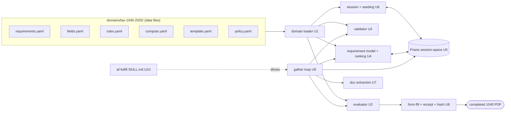
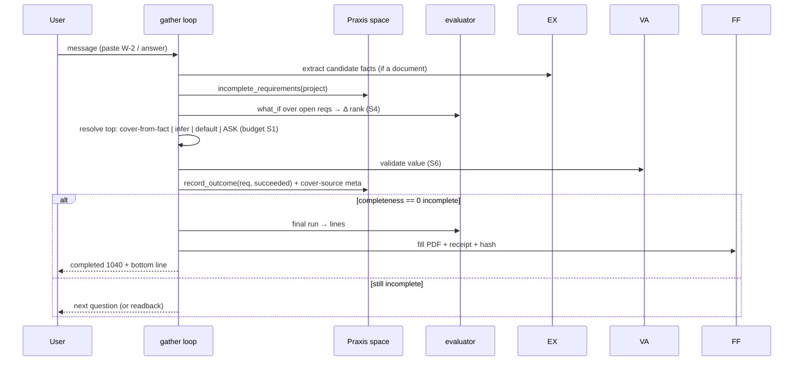

# feat: af-fulfill — the runtime that drives an end user to complete a structured deliverable

**Target repo:** agent_factory (paths below are relative to that repo unless prefixed `../agent_tax_harness`).

## Summary

Build `af-fulfill`: the generic, domain-agnostic runtime sibling to `af-build`. Where `af-build` drives
an *agent building software*, `af-fulfill` drives an *end user supplying facts* against a Praxis
requirement graph until the derived completeness gate opens, then produces the deliverable. A domain is
defined by data files; Praxis tracks the per-session run. Proving case #1 is the `tax-1040-2025` pack
(a completed Form 1040 from a single W-2). This plan covers the whole runtime end-to-end, wired to a
live Praxis session-space from the start.

---

## Problem Frame

The factory already is a requirements-as-plan, derived-completeness engine — but its loop assumes a
developer-agent builds each ticket, verified by commands. Taxes need the same completeness skeleton to
drive a taxpayer supplying facts, verified by "a valid value covers the requirement." `af-build` stays
code-only; `af-fulfill` is the new runtime for human fact-gathering. Nine design decisions (D1–D9) and
five live-Praxis probes in the origin proposal settled the architecture and proved it needs **no Praxis
changes** — the work is the runtime + skill. The `tax-1040-2025` domain pack
(`../agent_tax_harness/domains/tax-1040-2025/`) and the live `prd-tax-1040-2025` graph already exist.

---

## Key Technical Decisions

**KTD1. Reuse the factory's completeness spine; build no new gate engine.** Requirements are Praxis
facts (`category:"requirement"`, `source:"prd-<project>"`); completeness is derived from recorded
outcomes. `af-fulfill` reads `incomplete_requirements` and writes `record_outcome` — the same contract
`af-build` uses (`hooks/_praxis.py`). (see origin: D1, D6)

**KTD2. `af-fulfill` is an interactive request/response orchestrator, NOT a Stop-hook-gated autonomous
loop.** The actor is an end user in a chat, so the loop advances per user turn, and the completeness
gate is a runtime check before producing the deliverable — not the `build_completeness` Stop hook
(which is af-build's autonomous-turn mechanism). This is the core structural difference from af-build.

**KTD3. The deterministic evaluator is a closed-op calculation-graph runner.** It executes
`compute.yaml` over `rules.yaml` in three modes (`final` / `provisional` / `what_if`) with a per-line
basis (`known` / `assumed` / `unknown`). Closed op set
(`sum/add/subtract/copy/const/table_lookup/marginal_tax/clamp_min/round`), acyclic — a graph, not a
language. The LLM never does math. (see origin: D4, D8)

**KTD4. Domains are data files; the runtime takes a domain-dir path.** Pure loaders parse the pack;
`pyyaml` moves from a dev dep to a runtime dep. The `tax-1040-2025` pack is relocated into
`domains/tax-1040-2025/` in this repo as proving case #1. (see origin: D3, D4)

**KTD5. Per-session isolation via a Praxis space; seed from files, not a snapshot.** Each session is a
space (`PRAXIS_SPACE` → `x-praxis-space`, already supported by `hooks/_praxis.py`). The runtime seeds a
fresh space by ingesting the domain's requirement files — snapshots are space-scoped and cannot serve
as a cross-session template (proven by probe). (see origin: D3, Q1)

**KTD6. Mirror the pure adapter/partition pattern.** The requirement model adapts raw Praxis facts to a
typed `Requirement` and resolves cover-order/ranking as pure functions — following
`src/agent_factory/build_target.py` (`requirement_from_fact`, fail-safe on missing tags).

**KTD7. Add the runtime's Praxis *writes* in a fulfill-local client that follows the existing fail-closed
contract.** `hooks/_praxis.py` is read+outcome focused and lives in `hooks/` (Stop-hook subprocess). The
runtime needs writes (create space, ingest requirement facts, bind surface), so add a client in the
fulfill package mirroring `_praxis.py`'s auth/header/fail-closed shape rather than importing across the
`hooks/`↔`src/` boundary. Unifying the two clients later is deferred follow-up.

**KTD8. The harness's tax logic is a reference *oracle*, not a dependency.** The evaluator is validated
against `../agent_tax_harness/app/tax_engine.py`'s known outputs ($40k single → taxable $24,250 → tax
$2,672); the runtime stays data-driven and standalone.

---

## High-Level Technical Design

Component shape — data files on the left, Praxis on the right, the runtime in the middle:



One gather turn (the loop, per user message):



---

## Output Structure

```
src/agent_factory/fulfill/
  __init__.py
  domain.py        # U1 load + validate the pack into typed structures
  evaluator.py     # U2 closed-op calculation graph, 3 modes, per-line basis
  validate.py      # U3 field schemas + cross-field invariants (S6)
  requirements.py  # U4 fact→Requirement adapter, cover resolution, Δ-ranking
  policy.py        # U9 budget counter (S1) + guardrail scope (S9)
  praxis_client.py # U5 runtime Praxis writes (space/ingest/bind) + reads
  session.py       # U6 create space, seed from files, bind renders
  extract.py       # U7 document-extraction seam (W-2 → candidate facts)
  formfill.py      # U8 form-fill seam + provenance + receipt + hash
  loop.py          # U9 the gather orchestrator + event trace (S3)
domains/tax-1040-2025/   # KTD4 relocated proving pack
skills/af-fulfill/SKILL.md  # U10
tests/fulfill/           # mirrors the modules above
```

The tree is a scope declaration; per-unit `Files` are authoritative.

---

## Implementation Units

Grouped in four phases: **A** data-driven core (no Praxis), **B** Praxis session integration, **C** I/O
seams, **D** orchestration + skill.

### Phase A — Data-driven core

### U1. Domain-pack loader
- **Goal:** Parse + structurally validate the seven pack files into typed in-memory objects the rest of
  the runtime consumes; relocate the proving pack into this repo.
- **Requirements:** KTD4. Foundation for U2–U9.
- **Dependencies:** none.
- **Files:** `src/agent_factory/fulfill/domain.py`, `domains/tax-1040-2025/*` (relocated from
  `../agent_tax_harness/domains/tax-1040-2025/`), `tests/fulfill/test_domain.py`,
  `pyproject.toml` (promote `pyyaml` to runtime deps).
- **Approach:** One `load_domain(path)` returning a `Domain` with sub-objects (manifest, requirements,
  fields, rules, compute, template, policy). Validate cross-file integrity at load: every
  `requirements[*].field` exists in `fields`; every `compute` step `op` is in the closed vocabulary;
  every `table_lookup`/`marginal_tax` names a table in `rules`; every `template.line_map` key is a
  `compute` step id. Fail loud with the offending file+key.
- **Patterns to follow:** tolerant adapter shape of `build_target.py:requirement_from_fact`.
- **Test scenarios:**
  - Happy: loading `tax-1040-2025` returns 6 requirements, std-deduction + 4 bracket tables, 12 compute
    steps; all cross-file references resolve.
  - Edge: a pack missing `rules.yaml` → load error naming the file.
  - Error: a `compute` step with op `frobnicate` → rejected listing the unknown op; a `line_map` line
    referencing a non-existent step id → rejected naming the key.
  - Error: a requirement whose `field` is absent from `fields.yaml` → rejected.
- **Verification:** `load_domain("domains/tax-1040-2025")` succeeds; each malformed-pack fixture raises
  with a message naming the file and key.

### U2. Deterministic evaluator
- **Goal:** Execute the calculation graph in `final`/`provisional`/`what_if` modes, producing each line's
  value + basis, matching the harness engine exactly.
- **Requirements:** KTD3, KTD8; advances S2, S4, S10.
- **Dependencies:** U1.
- **Files:** `src/agent_factory/fulfill/evaluator.py`, `tests/fulfill/test_evaluator.py`.
- **Approach:** Pure. `evaluate(domain, facts, mode, overlay=None) -> {line: {value, basis}}`. Implement
  each closed op + the `post` ops (`clamp_min`, `round`). Basis propagation: any `unknown` input →
  `unknown`; else any `assumed` → `assumed`; else `known`. `provisional` fills missing required inputs
  from `policy.defaults` (marking `assumed`); `what_if` overlays hypothetical field values on a
  provisional run. `marginal_tax` reads the bracket rows (final row upper bound `inf`).
- **Patterns to follow:** marginal computation mirrors `../agent_tax_harness/app/tax_engine.py:compute_tax`.
- **Test scenarios:**
  - Happy (oracle): `final` on {filing_status: single, box1_wages: 40000, box2_withholding: 3200,
    other_income: 0} → taxable 24250, tax 2672, refund 528 — byte-equal to the harness engine across all
    four filing statuses and a spread of wage values.
  - Happy (basis): `provisional` with only wages known → line 12 `assumed` (default single), line 1a
    `known`; `what_if` overlaying filing_status=head_of_household changes line 12 to 23625.
  - Edge: taxable income clamps at 0 when deduction exceeds AGI; rounding matches whole-dollar rule.
  - Edge: an unknown required input with no default → that line and its dependents are `unknown` (null),
    not a crash.
  - Determinism: same inputs → identical output dict across repeated runs.
- **Verification:** the oracle test passes against `app/tax_engine.py` values; basis propagation and
  what_if deltas assert as specified.

### U3. Field validator (S6)
- **Goal:** Validate a gathered value against its `fields.yaml` schema and the cross-field invariants;
  reject, never coerce.
- **Requirements:** advances S6.
- **Dependencies:** U1.
- **Files:** `src/agent_factory/fulfill/validate.py`, `tests/fulfill/test_validate.py`.
- **Approach:** `validate_field(domain, name, value) -> Ok|Error(message)` for enum/number/integer/
  boolean/string with min/max/max_length; `validate_cross_field(domain, facts)` for invariants
  (withholding ≤ wages). Errors are structured (field + reason).
- **Patterns to follow:** mirrors the harness Pydantic boundary `../agent_tax_harness/app/schemas.py`.
- **Test scenarios:**
  - Happy: `single` passes filing_status enum; 40000 passes box1_wages.
  - Error: negative wages rejected; filing_status `martian` rejected; withholding 50000 with wages 40000
    rejected by the cross-field invariant naming the rule.
  - Edge: out-of-range integer dependents (21) rejected; over-length string rejected.
- **Verification:** valid inputs pass; each invalid fixture returns a structured error naming the field.

### U4. Requirement model + cover resolution + Δ-ranking
- **Goal:** Adapt Praxis requirement facts to a typed model, resolve each requirement's cover strategy,
  and rank open requirements by bottom-line impact.
- **Requirements:** KTD6; advances S4.
- **Dependencies:** U1, U2.
- **Files:** `src/agent_factory/fulfill/requirements.py`, `tests/fulfill/test_requirements.py`.
- **Approach:** `requirement_from_fact` (mirror build_target) reading `meta.requirement_id/field/verify/
  cover/renders/depends_on/guard/scope`. `resolve_cover(req, facts)` returns the first viable source in
  `cover` order (fact present → cover; else infer; else default; else ask). `rank_open(reqs, domain,
  facts)` returns open requirements ordered by `materiality` = max bottom-line swing across each req's
  candidate value set (computed via U2 `what_if`); below a configurable threshold → mark
  default-not-ask. Guards evaluated against known facts (closed predicate set); a guard that fails →
  requirement not asked (still defaultable).
- **Patterns to follow:** `src/agent_factory/build_target.py` (tolerant tags, fail-safe on missing).
- **Test scenarios:**
  - Happy: for a clean single-W-2 session, filing_status ranks highest materiality; other_income ranks
    near-zero and is marked default-not-ask.
  - Happy: `resolve_cover` picks `document:w2` for wages when a W-2 fact is present, else `ask`.
  - Edge: a guard `has_dependents_signal == true` absent → dependents requirement is not asked.
  - Edge: `depends_on` unmet (T4 before T2/T3) → not yet askable.
  - Error: a fact missing `meta.field` routes to a triage/needs-attention bucket, never silently into
    the ask set.
- **Verification:** ranking orders by computed Δ; cover resolution and guard/dep gating assert as
  specified.

---

### Phase B — Praxis session integration

### U5. Runtime Praxis client (writes + reads)
- **Goal:** Give the runtime the Praxis operations it needs, under the existing fail-closed contract.
- **Requirements:** KTD5, KTD7, KTD1.
- **Dependencies:** none (parallel to Phase A).
- **Files:** `src/agent_factory/fulfill/praxis_client.py`, `tests/fulfill/test_praxis_client.py`.
- **Approach:** Mirror `hooks/_praxis.py` (auth headers incl. `x-praxis-space`, fail-closed
  `PraxisUnreachable`). Add writes: `create_space(space_id, name)`, `ingest_requirement(fact)` /
  `seed_requirements(facts)`, `bind_surface(req_id, screen_id, project, title)`; reuse reads
  `incomplete_requirements`, `completeness_summary`, `record_outcome`, `get_fact`. Space is selected by
  setting the `x-praxis-space` header per call (driven by the active session).
- **Patterns to follow:** `hooks/_praxis.py` transport/auth/`_request` shape verbatim.
- **Test scenarios:**
  - Happy: against a stub HTTP server, `seed_requirements` POSTs the expected ingest body; `record_outcome`
    posts `{success:true}`; reads parse the documented shapes.
  - Error: a 5xx or unreachable host raises `PraxisUnreachable` (fail-closed), never returns empty.
  - Edge: the `x-praxis-space` header is present iff a session space is active.
  - Integration: a live smoke test (guarded by env) seeds a throwaway space and reads back
    `completeness_summary` == total/0 — mirrors the validated probe.
- **Verification:** unit tests pass against the stub; the guarded live smoke test round-trips.

### U6. Session lifecycle + seeding
- **Goal:** Create a per-session Praxis space, seed it from the domain requirement files, and bind each
  requirement's `renders` edge to the deliverable surface.
- **Requirements:** KTD5, D9.
- **Dependencies:** U1, U5.
- **Files:** `src/agent_factory/fulfill/session.py`, `tests/fulfill/test_session.py`.
- **Approach:** `start_session(domain, session_id)` → create space `sess-<id>`, ingest each requirement
  as a `category:"requirement"` fact with `source:"prd-<project>"` and the pack meta
  (requirement_id/field/verify/cover/renders/depends_on/guard/scope), then `bind_surface` each rendering
  requirement to the manifest's deliverable screen. Returns a `Session` handle carrying the space id and
  domain. Session teardown (space delete) is owned by Praxis lifecycle (Q7) — provide a `close()` hook
  but do not implement TTL/cleanup policy here.
- **Patterns to follow:** the authoring sequence proven in the origin proposal's Q2 probe.
- **Test scenarios:**
  - Happy: starting a tax session ingests 6 requirements and binds 5 renders edges; `completeness_summary`
    reports `0/6`, `surface_coverage(mvp)` reports `0 uncovered`.
  - Edge: a requirement with `renders: []` (dependents) is seeded but not bound.
  - Error: Praxis unreachable during seeding raises (fail-closed) and does not leave a half-seeded
    session silently usable.
  - Integration: two sessions seed two distinct spaces; one session's outcome does not affect the other's
    completeness (isolation).
- **Verification:** both gates green for a fresh tax session; isolation asserted across two sessions.

---

### Phase C — I/O seams

### U7. Document-extraction seam
- **Goal:** Turn an uploaded document into candidate facts the loop can cover requirements with.
- **Requirements:** advances S6 (typed boundary at intake), the cover-source `document:w2`.
- **Dependencies:** U1, U3.
- **Files:** `src/agent_factory/fulfill/extract.py`, `tests/fulfill/test_extract.py`,
  `tests/fulfill/fixtures/` (a sample W-2 text/pdf).
- **Approach:** A generic `Extractor` interface (`extract(document) -> {field: value}`) plus a tax W-2
  extractor that maps W-2 text → `box1_wages`/`box2_withholding`/`employer`/`employee_name`. Reuse the
  harness's text approach (`../agent_tax_harness/app/main.py:upload_w2` for PDF/text extraction; map the
  text to fields here). Extracted values pass through U3 before becoming facts.
- **Patterns to follow:** `../agent_tax_harness/app/main.py` upload/parse path.
- **Test scenarios:**
  - Happy: the sample W-2 text yields box1=40000, box2≈3200, employer/name populated.
  - Edge: a messy W-2 missing box 2 → box1 extracted, box2 left unknown (asked later), no crash.
  - Error: an unreadable/empty document → structured "no readable fields" result, not an exception.
- **Verification:** the sample W-2 fixture extracts the expected fields; partial/empty inputs degrade
  gracefully.

### U8. Form-fill seam + provenance + receipt + hash
- **Goal:** Write the evaluator's lines into the official 1040 PDF, bundle provenance, the assumption
  receipt, and a content hash.
- **Requirements:** advances S2, S5, S7, S10.
- **Dependencies:** U1, U2.
- **Files:** `src/agent_factory/fulfill/formfill.py`, `tests/fulfill/test_formfill.py`.
- **Approach:** Map `compute` line ids → form fields via `template.line_map` (resolve actual AcroForm
  field names from the PDF at startup; reportlab-shaped fallback). Attach per-line provenance
  `{value, source}` from cover-source; build the assumption receipt from requirements closed by default;
  compute a sha256 over computed lines + identity fields + receipt. Reuse the harness's PDF approach
  (`../agent_tax_harness/app/form1040.py`).
- **Patterns to follow:** `../agent_tax_harness/app/form1040.py`.
- **Test scenarios:**
  - Happy: a completed tax session produces a PDF with line 1a/12/15/16/34 populated; the receipt lists
    every defaulted requirement with its justification; same inputs → identical hash.
  - Edge: AcroForm field-name drift → reportlab fallback still produces a populated form (labeled).
  - Edge: a value with no non-LLM provenance fails an assertion (S2 boundary check).
- **Verification:** the golden $40k single session yields the expected lines, a stable hash, and a
  receipt naming the defaulted fields.

---

### Phase D — Orchestration + skill

### U9. The gather loop orchestrator (+ policy, trace)
- **Goal:** Drive one user turn end-to-end: extract, rank, resolve (cover/infer/default/ask under
  budget), validate, record outcome, and — when complete — produce the deliverable; emit a typed event
  trace throughout.
- **Requirements:** advances S1, S3, S4, S5, S9; ties the runtime together.
- **Dependencies:** U2, U3, U4, U6, U7, U8.
- **Files:** `src/agent_factory/fulfill/loop.py`, `src/agent_factory/fulfill/policy.py`,
  `tests/fulfill/test_loop.py`, `tests/fulfill/test_policy.py`.
- **Approach:** `policy.py`: a `Budget(max_asks)` counter gating the only ask channel (S1 — only
  `via=ask` decrements); guardrail scope checks from `policy.yaml` (S9, stable rule ids). `loop.py`:
  `handle_turn(session, message)` → optionally extract (U7); read `incomplete_requirements`; rank (U4);
  resolve the top open requirement (cover-from-fact → record_outcome with `cover_source:user|document`;
  infer/default → record_outcome with `cover_source:default` + receipt line; else emit one question via
  the budgeted ask channel); validate via U3 before any outcome; when `completeness_summary` shows 0
  incomplete, run U2 `final` and U8 to produce the deliverable. Every step emits a typed event (S3).
- **Patterns to follow:** the per-ticket lifecycle discipline in `hooks/build_completeness_gate.py`
  (FIND→resolve→record), adapted to interactive turns; fail-closed Praxis reads.
- **Execution note:** Implement the loop test-first against a stubbed Praxis (U5 stub) so the
  turn-by-turn contract is pinned before wiring the live client.
- **Test scenarios:**
  - Happy (full run): paste the sample W-2 → wages/withholding covered from the document (0 questions);
    filing_status asked once (highest materiality); other_income + remaining defaulted; completeness hits
    0; a 1040 with a $528 refund and a 1-line assumption receipt is produced.
  - Budget (S1): the ask channel hard-refuses a 6th question; warmth/acknowledgement turns do not
    decrement; remaining requirements are defaulted with receipt lines.
  - Edge: a user-corrected fact (wages) re-runs the evaluator and updates downstream lines (recompute,
    not stale).
  - Error/guardrail (S9): a pasted 1099 / a tax-advice request emits a typed scope refusal naming the
    rule id and does not fabricate a line; an SSN is redacted.
  - Integration: each turn emits trace events; the completeness gate (not a Stop hook) is what permits
    `produce`, and producing before completeness is refused.
- **Verification:** the golden end-to-end session produces the expected return, hash, and receipt; the
  budget, guardrail, and recompute behaviors assert as specified.

### U10. The af-fulfill skill
- **Goal:** The `SKILL.md` that drives the runtime — the methodology, the budget/guardrail posture, and
  how the agent uses the loop and produces the deliverable.
- **Requirements:** packages U1–U9 as an invocable factory skill, sibling to af-build.
- **Dependencies:** U9.
- **Files:** `skills/af-fulfill/SKILL.md`.
- **Approach:** Mirror `skills/af-build/SKILL.md` structure (methodology header, the loop, fail-closed
  Praxis, single-source-of-truth). State the actor difference (end user, not coding agent), the
  interactive gate (KTD2), the seed-from-files session model (KTD5), and the data-first domain contract.
  Reference the runtime modules and the `tax-1040-2025` proving domain.
- **Patterns to follow:** `skills/af-build/SKILL.md`, `skills/af-intake-plan/SKILL.md`.
- **Test scenarios:** `Test expectation: none -- documentation/skill manifest, no behavioral code.`
- **Verification:** the skill reads coherently against af-build/af-intake-plan; a dry read-through drives the
  U9 loop on the tax pack without inventing steps.

---

## Scope Boundaries

- **In scope:** the full `af-fulfill` runtime + skill, wired to live Praxis session-spaces, proven on
  the `tax-1040-2025` pack to produce a completed 1040 satisfying S1–S10.
- **Deferred to Follow-Up Work:** unifying `praxis_client.py` with `hooks/_praxis.py` (KTD7);
  itemize-vs-standard and CTC (the post-mvp dependents branch, T6); a second proving domain.
- **Outside this product's identity:** changing `af-build`/the coding loop; real e-filing, real PII, or
  tax advice (educational prototype).
- **Owned by Praxis, not this plan (Q7):** per-session space lifecycle, TTL/cleanup, auth hardening, and
  multi-tenancy. `af-fulfill` inherits whatever session/space semantics Praxis provides.

---

## Risks & Dependencies

- **Praxis is a hard runtime dependency (fail-closed).** Unlike the harness's degrade-to-fallback rule
  lookup, the af-fulfill *control flow* reads completeness live, so Praxis-down blocks a session. Mirror
  `_praxis.py`'s loud fail-closed contract; document the local-dev `PRAXIS_AUTH_DISABLED`/`localhost:8000`
  seam.
- **Evaluator/oracle drift.** If the data-driven evaluator and the harness engine diverge, the golden
  oracle test (U2) catches it — keep that test the gate on every evaluator change.
- **AcroForm field-name drift year-to-year** (U8) — resolve the field map at startup, reportlab fallback.
- **Space proliferation** — one space per session accumulates; cleanup is Q7 (Praxis-owned), flagged not
  solved.

---

## Success Criteria

- The golden tax session (sample W-2, ≤5 questions) produces a completed 1040 PDF with a $528 refund, a
  stable content hash, and an assumption receipt — driven end-to-end through live Praxis.
- The data-driven evaluator matches `app/tax_engine.py` across all filing statuses and a wage spread.
- Both gates are green for a seeded session (`completeness_summary` 0 incomplete after the run;
  `surface_coverage(mvp)` 0 uncovered).
- The budget (S1) and scope guardrails (S9) hold under adversarial input (6th question refused, 1099 /
  advice / PII handled).
- `af-build` is untouched; no Praxis schema changes were required.

---

## Open Questions (Deferred to Implementation)

- Exact AcroForm field names for the current `f1040.pdf` (resolve at startup, U8).
- The materiality threshold below which a requirement is defaulted rather than asked (U4) — tune against
  the golden session.
- The precise event-trace schema surfaced to a UI (U9) — shape during implementation against the
  harness's existing trace pane as reference.
- Whether the runtime exposes an HTTP surface (FastAPI, like the harness) or a library API consumed by
  the skill — settle when wiring U10 to a runnable entry point.
