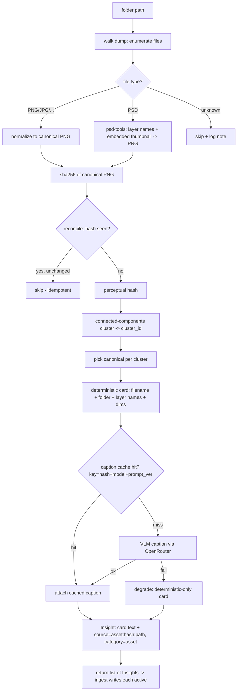
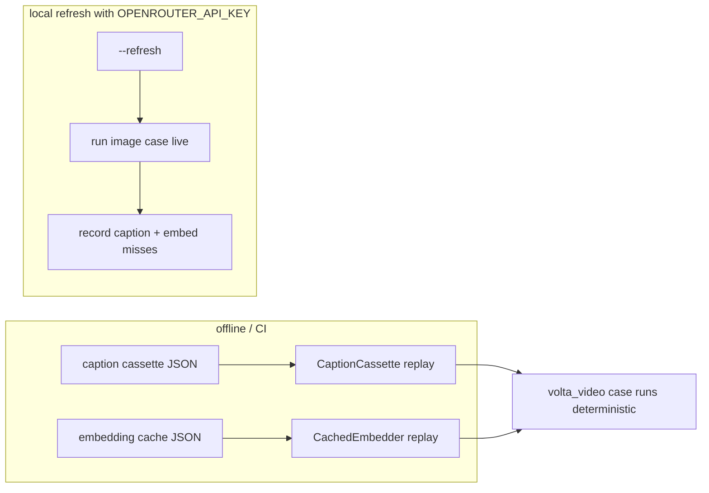

# feat: Image / Asset-Dump Ingestion into the Knowledge Graph

## Summary

Add an `ImageIngestor` that ingests a folder of visual assets (PNGs + PSDs) into the knowledge graph by reusing the **existing** text-embedding + dedup/merge path — no new graph mechanisms. Each asset becomes provenance carried on a derived **text card** (filename + folder taxonomy + PSD layer names + an eager VLM caption), written **active**. Throughput comes from sha256 idempotent reconcile, content-hash caption caching, perceptual-hash variant collapse, and batched enrichment. The `volta_video` eval drops its hand-authored `ASSET_CARDS` in favor of cards auto-generated from the mounted fixture, running on the `vector` substrate offline via committed caches.

---

## Problem Frame

Praxis cannot ingest images. Visual assets enter only as hand-authored text cards in `knowledge/evals/cases/matt/volta_video/_generate.py` (`ASSET_CARDS`), which rot against the real files and require manual labor. We have a real dump to ingest (`AlchemistAssets`: `Common/` PNGs + `Photoshop Files/` PSDs) and want a refactor that ingests such folders **without** the naive per-file-per-run VLM slow path.

The ingestion contract today (`knowledge/injestion/parent_injestor.py`) is `str`-in: `Ingestor.synthesis(raw_input: str) -> list[Insight]`, and `ingest()` writes `insight.raw_text` per insight via `KnowledgeGraph.write(content: str, *, state)`. There is no seam for a binary asset, no dedup/caching, no concurrency.

**Key framing (carried from origin):** the MMKG explicit-linking pattern is rejected — Praxis retrieves by vector similarity, not edge traversal, so images reuse what text already does. Pixel/CLIP embeddings are deferred. The richer signal is a VLM caption, which produces *text* and flows through the existing pipeline. (see origin: `docs/brainstorms/2026-06-23-image-asset-ingestion-requirements.md`)

---

## Requirements

- **R1.** Ingest a folder of mixed assets (PNG, PSD) through `build_trio` → an image-aware ingestor. (origin: In-scope 1, 7)
- **R2.** Each asset yields a derived **text card** through the existing embedder + dedup/merge path; provenance (path + content hash) is retained. (origin: In-scope 1)
- **R3.** Card content = deterministic signals (filename, folder taxonomy, PSD layer names, dims) **+ an eager VLM caption** for the canonical image of each cluster. (origin: In-scope 2, 3)
- **R4.** VLM captions are cached by `hash(canonical_png_bytes) + model_id + prompt_version`; captioned at most once per unique image ever. (origin: In-scope 3, Resolved: cache key)
- **R5.** PSDs are handled via layer-name + embedded-thumbnail extraction; never full-rasterize. (origin: In-scope 4)
- **R6.** All supported raster inputs normalize to canonical PNG; one uniform downstream path. Unknown files are skipped with a logged note, never fatal. (origin: In-scope 9)
- **R7.** Perceptual-hash near-duplicates collapse to one canonical card per cluster before writing. (origin: In-scope 5, Call-out 2)
- **R8.** Idempotent content-addressed reconcile: re-ingesting an unchanged dump performs near-zero work. (origin: In-scope 6)
- **R9.** Generated cards land **active** (explicit add), for both eval seeds and production. (origin: In-scope 10, see [[explicit-adds-go-active]])
- **R10.** `volta_video` runs the real `ImageIngestor` live, reading captions + embeddings from committed content-hash caches; auto-generated cards replace hand-authored `ASSET_CARDS`. Offline + deterministic in CI. (origin: In-scope 8)
- **R11.** Asset-node dedup is **per-tenant**; the caption/embedding cache is **global**. (origin: Resolved: dedup vs tenancy)
- **R12.** A VLM caption failure degrades gracefully — the asset still lands with its deterministic card. (origin: Resolved: caption failure)

---

## Key Technical Decisions

- **KTD1 — Reuse `Insight`, no new node type.** An asset's derived card is `Insight(raw_text=<card>, source="asset:<sha256>:<relpath>", category="asset")`. The existing model already carries `source` (provenance) and `category`. No new graph schema. (R2)
- **KTD2 — Provenance rides card text + `Insight.source` (not a `write()` change).** `KnowledgeGraph.write` is marked "freeze this contract" and takes only `(content, state)` — it drops `Insight` metadata today. v1 encodes the relative path inside the card text (the existing `path=assets/<file>.png` convention the agent already consumes) so retrieval surfaces a usable reference with zero contract change. Extending `write()` to persist `Insight` metadata is deferred. (Call-out 1; R2; origin Outstanding: schema)
- **KTD3 — `ImageIngestor(Ingestor)` overrides `synthesis`; input is a folder path string.** Keeps the frozen `synthesis(raw_input: str)` signature: `raw_input` is the asset folder path. `synthesis` walks the folder, normalizes, dedups, captions, and returns `list[Insight]` (one canonical card per cluster). The concrete `ingest()` loop is inherited; callers pass `state="active"`. (R1, R9)
- **KTD4 — Captions use the cassette pattern, not a bespoke cache.** Mirror `merge_model`/`conflict_model`: a `CaptionCassette` keyed by `hash+model+prompt_version` under `knowledge/evals/fixtures/captions/`, replayed offline, computed live with `OPENROUTER_API_KEY`, gated by a new `real_captions` capability. (R4, R10)
- **KTD5 — VLM model = `google/gemini-flash-1.5-8b` via OpenRouter.** Cheapest vision-capable tier; step-up fallback `google/gemini-2.0-flash-001`. Reuse `OpenRouterLlm` with image-message support. (R3; origin: decided)
- **KTD6 — Variant collapse happens in `synthesis` before writing.** Perceptual-hash → connected-components → one canonical card per cluster; caption only the canonical. Persisting first-class `cluster_id`/`variantOf` graph structure defers to the clustering roadmap. (Call-out 2; R7; see [[clustering-design-direction]])
- **KTD7 — Eval wires the `vector` substrate + `cached` embedder + caption cassette.** Exercises the real embed + dedup path offline, not `in_memory`. Requires a `caption_model` axis on `EvalCase` and an image-asset seed channel. (R10)

---

## High-Level Technical Design

### Ingest flow (`ImageIngestor.synthesis`)



### Eval offline replay (mirrors embedder/verdict cassettes)



---

## Output Structure

```
knowledge/injestion/injestor_variants/
  image_injestor.py              # ImageIngestor(Ingestor)  [U2]
knowledge/injestion/image/
  __init__.py
  normalize.py                   # any raster -> canonical PNG; PSD via psd-tools  [U1]
  hashing.py                     # sha256 + perceptual hash + connected-components cluster  [U3]
  cards.py                       # deterministic card text from path/folder/layers/dims  [U2]
  captioner.py                   # VLM caption call (OpenRouter), graceful failure  [U4]
knowledge/llm/
  caption_cassette.py            # CaptionCassette (mirrors verdict_cassette.py)  [U4]
knowledge/evals/fixtures/captions/
  <model-slug>.json              # committed caption cassette  [U6]
knowledge/evals/cases/matt/volta_video/
  fixture/assets/...             # existing PNGs + new AlchemistAssets dump  [U7]
  case.yaml / _generate.py       # regenerated: image-asset seed, no hand ASSET_CARDS  [U7]
```

The per-unit **Files** sections remain authoritative.

---

## Implementation Units

### U1. Canonical-PNG normalization + PSD extraction
**Goal:** A pure module that turns any supported asset path into a canonical PNG (bytes) plus extracted metadata (dims, and for PSD the layer-name tree); unknown types return a skip signal.
**Requirements:** R5, R6.
**Dependencies:** none.
**Files:** `knowledge/injestion/image/normalize.py`, `knowledge/injestion/image/__init__.py`, `tests/injestion/image/test_normalize.py`.
**Approach:** A `normalize(path) -> NormalizedAsset | None` returning canonical PNG bytes + `dims` + optional `layer_names`. Raster inputs decode via Pillow and re-encode PNG. PSDs use `psd-tools` for the embedded composite/thumbnail and layer-name tree (no full rasterize); smart-object layers are skipped. Unknown/unsupported types return `None` with a logged note. Add `psd-tools` + `Pillow` (or `imagehash` which pulls Pillow) to deps.
**Patterns to follow:** small typed pure module like `knowledge/injestion/injestion_def.py`; dependency-light functions.
**Test scenarios:**
- PNG input → returns PNG bytes + correct dims (happy path).
- JPG/other raster → re-encoded to PNG, dims preserved.
- PSD with named layers → layer names extracted, thumbnail returned, no full rasterize (assert psd-tools thumbnail path used).
- PSD with a smart-object layer → that layer skipped, others retained, no crash.
- Unknown file (`.txt`, `.aep`) → returns `None` + logged note (assert no exception).
- Corrupt/zero-byte image → returns `None`, logged, does not raise.
**Verification:** module imports with deps installed; all normalization tests pass; no full-PSD rasterization on the layered fixture.

### U2. `ImageIngestor` + deterministic card generation
**Goal:** An `ImageIngestor(Ingestor)` whose `synthesis(folder_path)` produces one `Insight` per asset (deterministic card only, captioning added in U4), and card-builder helpers.
**Requirements:** R1, R2, R3 (deterministic half), R9.
**Dependencies:** U1.
**Files:** `knowledge/injestion/injestor_variants/image_injestor.py`, `knowledge/injestion/image/cards.py`, `tests/injestion/test_image_injestor.py`.
**Approach:** `synthesis(raw_input)` treats `raw_input` as a folder path; walks it (recursive), calls `normalize` per file, and for each surviving asset builds a deterministic card via `cards.build_card(relpath, folder_taxonomy, layer_names, dims)`. Returns `list[Insight]` with `raw_text=<card>`, `source="asset:<sha256>:<relpath>"`, `category="asset"`. The card embeds the relative `assets/<file>.png` path (KTD2). Folder taxonomy (`Common/` vs `Photoshop Files/`) becomes a card field. Callers invoke `ingest(folder, state="active")` (R9). Dedup/cluster/caption are layered in U3/U4 — here each file is its own card.
**Execution note:** implement card generation test-first — the card text is a graded contract for the eval.
**Patterns to follow:** `PromptIngestor` (`knowledge/injestion/injestor_variants/prompt_injestor.py`) for the `synthesis` override and injectable-dependency shape; `Insight` fields in `knowledge/injestion/injestion_def.py`.
**Test scenarios:**
- Folder with two PNGs → two Insights, each with `source` carrying sha256 + relpath, `category="asset"`.
- Card text includes filename, folder taxonomy, dims, and the `assets/<file>.png` path token.
- PSD asset → card includes extracted layer names.
- `ingest(folder, state="active")` writes cards as active (assert via graph state, not proposed). Covers R9.
- Unknown file in folder → no Insight emitted, run completes.
- Empty folder → returns `[]`, no error.
**Verification:** ingesting the volta fixture folder yields one active card per asset with provenance; card text matches the documented field shape.

### U3. Content-hash reconcile + perceptual-hash variant collapse
**Goal:** Idempotent reconcile (skip unchanged by sha256) and perceptual-hash clustering that collapses near-duplicates to one canonical card per cluster.
**Requirements:** R7, R8.
**Dependencies:** U1, U2.
**Files:** `knowledge/injestion/image/hashing.py`, `tests/injestion/image/test_hashing.py`, (modify) `knowledge/injestion/injestor_variants/image_injestor.py`.
**Approach:** `hashing.py` provides `content_hash(png_bytes)` (sha256) and `perceptual_hash(png_bytes)` (via `imagehash`). A `cluster(assets) -> list[Cluster]` builds a similarity graph (perceptual-hash Hamming distance < threshold), runs connected-components (non-transitive — do not use transitive equivalence classes), assigns a `cluster_id`, and picks a canonical member. `ImageIngestor.synthesis` reconciles against already-seen content hashes (an injected seen-set / the graph's existing `asset:` sources) to skip unchanged files, then emits one card per cluster with variant relpaths listed in the card. Threshold is a module constant (tunable; see Open Questions).
**Patterns to follow:** pure-function module like U1; connected-components over an adjacency map.
**Test scenarios:**
- Two byte-identical files → one content hash, one card.
- A PSD and its exported PNG (near-dup) → same cluster_id, one canonical card, both relpaths listed as variants. Covers R7.
- Three images where A~B and B~C but A≁C → connected-components keeps them one component (assert non-transitive handling does not split B).
- Re-running `synthesis` with an unchanged folder + populated seen-set → zero new cards (idempotent). Covers R8.
- Adding one new file to a seen folder → exactly one new card emitted.
- Distinct images beyond threshold → separate clusters, separate cards.
**Verification:** re-ingest of an unchanged dump emits nothing; PSD+PNG pair collapses to one captioned canonical.

### U4. VLM captioner + caption cassette + graceful failure
**Goal:** Eager VLM captioning of the canonical image per cluster, cached by `hash+model+prompt_version`, with graceful degradation on failure.
**Requirements:** R3 (caption half), R4, R12.
**Dependencies:** U1, U2, U3.
**Files:** `knowledge/injestion/image/captioner.py`, `knowledge/llm/caption_cassette.py`, `tests/llm/test_caption_cassette.py`, `tests/injestion/image/test_captioner.py`, (modify) `image_injestor.py`.
**Approach:** `captioner.caption(png_bytes, *, model, prompt_version, cassette, llm)` computes the cache key `sha256(png_bytes)+model+prompt_version`; on hit returns the cached caption; on miss (with a live `llm`) calls the OpenRouter VLM with an image message and records to the cassette; on failure returns `None`. `CaptionCassette` mirrors `knowledge/llm/verdict_cassette.py` (`VerdictCassette`): JSON keyed by the composite key, `model_id`, `allow_compute`. `ImageIngestor` merges the caption into the canonical card when present; when `None`, the card stays deterministic-only (R12). The caption prompt + `prompt_version` constant live in `captioner.py`.
**Execution note:** test the failure path first — graceful degradation is a hard requirement.
**Patterns to follow:** `knowledge/llm/verdict_cassette.py` and `_merge_judge_for`/`_eval_embedder` wiring in `knowledge/evals/run.py`; `OpenRouterLlm` image-message support in `knowledge/llm/llm_variants/openrouter_llm.py`.
**Test scenarios:**
- Cache hit → returns cached caption, no LLM call (assert llm not invoked). Covers R4.
- Cache miss with live llm → calls VLM once, records caption to cassette under the composite key.
- Same image, different `model_id` or `prompt_version` → cache miss (key includes both). Covers R4.
- LLM raises / times out → `caption` returns `None`; card falls back to deterministic-only; no exception propagates. Covers R12.
- `allow_compute=False` + miss → returns `None` (offline, no compute), does not raise.
- Variant cluster → only the canonical image is captioned (one VLM call per cluster, not per file).
**Verification:** offline run with a populated cassette produces captioned cards and makes zero network calls; a missing key with no live llm degrades cleanly.

### U5. Eval schema + harness wiring for image assets
**Goal:** Extend `EvalCase` and the eval runner so a case can seed image assets through `ImageIngestor` with a caption cassette, gated by a `real_captions` capability.
**Requirements:** R7–R11 (eval-facing), R10.
**Dependencies:** U2, U3, U4.
**Files:** `knowledge/evals/eval_def.py`, `knowledge/evals/run.py`, `tests/evals/test_image_seed.py`.
**Approach:** Add to `EvalCase`: `caption_model: str | None = None` (OpenRouter VLM; None ⇒ deterministic-only) and an image-asset seed channel on `SeededInsight`, e.g. `via_image_ingestor: list[str]` (folder paths relative to the case `fixture/`). In `run.py`: a `_caption_cassette_for(case)` mirroring `_merge_judge_for` (cassette under `CAPTION_CACHE_DIR = fixtures/captions/`), an `_image_ingestor_for(case)` that wires `ImageIngestor` with the embedder/graph used by `_build_trio_for`, and seed logic that ingests image folders with `state="active"` (R9). Add `real_captions` to `harness_capabilities()` (committed cassette or live key) and to `case_needs()` (when `caption_model` set) so cases SKIP rather than mis-grade offline. Per-tenant dedup vs global cache (R11) is honored because the cassette is keyed by content hash only (global) while graph writes are tenant-scoped by substrate.
**Patterns to follow:** `_merge_judge_for` / `_eval_embedder` / `harness_capabilities` / `case_needs` in `knowledge/evals/run.py`; `SeededInsight` and the `model_validator` in `eval_def.py`.
**Test scenarios:**
- `EvalCase` with `caption_model` set and no caption source → `case_needs` includes `real_captions`; case SKIPs offline (assert via `unmet_needs`).
- Committed caption cassette present → `harness_capabilities` includes `real_captions`; case is runnable offline.
- Seeding `via_image_ingestor` → `ImageIngestor.ingest(folder, state="active")` invoked; cards land active.
- Case with `caption_model=None` → image cards still produced (deterministic-only), no caption source required.
- Existing text-only cases unaffected (schema additions are optional with defaults). Covers regression.
**Verification:** a minimal image case loads, validates, and runs offline against a committed cassette; text cases are unchanged.

### U6. Caption-cassette refresh tooling
**Goal:** A `--refresh` path that records the caption cassette for image cases, parallel to `embed_cache.py`.
**Requirements:** R4, R10.
**Dependencies:** U4, U5.
**Files:** `knowledge/evals/caption_cache.py` (or extend `knowledge/evals/embed_cache.py`), `tests/evals/test_caption_cache.py`.
**Approach:** Mirror `embed_cache.refresh()`: require `OPENROUTER_API_KEY`, delete the model's caption cassette, re-run every case with a `caption_model` so the recording `CaptionCassette` captures exactly the captions those cases embed (canonical-per-cluster only), then commit. Reuse `_image_ingestor_for` / `_build_trio_for` from U5. Document the command in the module docstring (`uv run python -m knowledge.evals.caption_cache --refresh`).
**Patterns to follow:** `knowledge/evals/embed_cache.py` end-to-end.
**Test scenarios:**
- Refresh with a fake/stubbed VLM → cassette file written with one entry per unique canonical image.
- Refresh without `OPENROUTER_API_KEY` → prints guidance, exits non-zero, writes nothing.
- No `caption_model` cases present → prints "nothing to record", exits 0.
**Verification:** running refresh against the volta case (stubbed) produces a committed cassette that makes the case runnable offline.

### U7. Regenerate the `volta_video` case from the asset dump
**Goal:** Mount the `AlchemistAssets` dump into the fixture, and regenerate `case.yaml` so asset cards are produced by `ImageIngestor` instead of hand-authored `ASSET_CARDS`.
**Requirements:** R10, plus preserves the origin eval's grading intent.
**Dependencies:** U5, U6.
**Files:** `knowledge/evals/cases/matt/volta_video/_generate.py`, `knowledge/evals/cases/matt/volta_video/case.yaml`, `knowledge/evals/cases/matt/volta_video/fixture/assets/...`, `knowledge/evals/fixtures/captions/<model-slug>.json`.
**Approach:** Copy the `AlchemistAssets` `Common/` + `Photoshop Files/` assets into `fixture/assets/` (canonical layout the agent references). In `_generate.py`: remove the hand-authored `ASSET_CARDS` list; instead set `via_image_ingestor: [<fixture assets dir>]` and `caption_model: google/gemini-flash-1.5-8b`, keeping `VOLTA_FACTS` + `STYLE_PROFILE` as `direct_to_graph` and the Wikipedia article `via_ingestor`. Set `substrate: vector`, `embedder: cached`. Keep the existing deterministic checks + rubric. Regenerate `case.yaml`, then run U6 refresh to commit the caption cassette + embedding cache. Verify the `references_assets` check (`assets/` paths in output) still passes with generated cards.
**Execution note:** run the case offline (`--fake` / component) after refresh to confirm determinism before committing caches.
**Patterns to follow:** existing `_generate.py` structure; `embed_cache --refresh` workflow; `load_case` fixture mounting (`fixture/` dir).
**Test scenarios:**
- `_generate.py` runs and emits a `case.yaml` with no `ASSET_CARDS`, an image seed channel, and `caption_model` set.
- Loaded case validates (`EvalCase.model_validate`) and is runnable offline with committed caches (no network).
- Generated cards reference `assets/<file>.png` paths so the `references_assets` deterministic check passes. Covers R10.
- Re-running the case twice offline yields identical seeded knowledge (determinism).
**Verification:** the volta case passes offline with auto-generated cards at quality ≥ the hand-authored cards for the flat PNGs (caption present); no live API calls in CI.

---

## Scope Boundaries

### Deferred for later (origin)
- CLIP/SigLIP pixel embeddings + cross-modal pixel search (separate infra + vector space).
- Lazy caption-on-retrieval (eager + cache chosen for day-one card quality).

### Outside scope — rejected (origin)
- Explicit cross-modal entity-linking edges (`imageOf`/`sameAs`) — no parity with text retrieval.
- Object-store byte storage as a coupled decision (independent of this feature).

### Deferred to follow-up work (plan-local)
- Extending `KnowledgeGraph.write` to persist `Insight` metadata (provenance, category) as structured fields rather than card text (KTD2).
- Persisting first-class `cluster_id` / `variantOf` graph structure (KTD6) — lands with the clustering-roadmap work ([[clustering-design-direction]]).
- Batched/concurrent enrichment tuning — captioning is cassette-cached so per-run cost is already near-zero offline; revisit batch limits when ingesting large live dumps.

---

## Risks & Dependencies

- **New runtime deps** (`psd-tools`, `Pillow`, `imagehash`). Risk: install footprint / CI. Mitigation: confirm they install in the `uv` env (U1) before downstream units.
- **`OpenRouterLlm` image-message support.** Risk: the existing wrapper may be text-only. Mitigation: verify/extend image-message capability in U4 before wiring the captioner; if absent, that becomes the first sub-task of U4.
- **Caption quality on flat PNGs** with `gemini-flash-1.5-8b`. Mitigation: fallback `gemini-2.0-flash-001` (KTD5); the eval rubric surfaces regressions.
- **PSD variety** (smart objects, unusual color modes) beyond psd-tools support. Mitigation: skip unsupported layers, degrade to thumbnail + filename (U1).
- **Frozen `KnowledgeGraph.write` contract.** Mitigation: KTD2 avoids touching it; any change is deferred follow-up.

---

## Open Questions (planning → implementation)

- Perceptual-hash algorithm (pHash vs dHash) and Hamming threshold — pick a default in U3, tune against the real dump.
- Exact caption prompt wording + `prompt_version` seed value (U4).
- Whether `via_image_ingestor` paths are relative to `fixture/` or `source_dir` — settle in U5 against `load_case`'s mounting.
- Canonical-PNG re-encode settings (downscale cap for very large PSphotos before captioning) — U1.

---

## Sources & Research

- Origin requirements: `docs/brainstorms/2026-06-23-image-asset-ingestion-requirements.md`
- Upstream ideation (10 ideas + external sources): `docs/ideation/2026-06-23-image-dump-ingestion-ideation.md`
- Codebase patterns grounding this plan: `knowledge/injestion/parent_injestor.py`, `knowledge/injestion/injestor_variants/prompt_injestor.py`, `knowledge/injestion/injestion_def.py`, `knowledge/wiring.py`, `knowledge/evals/run.py` (cassette/embedder wiring), `knowledge/evals/embed_cache.py`, `knowledge/evals/eval_def.py`, `knowledge/llm/verdict_cassette.py` (cassette pattern).
