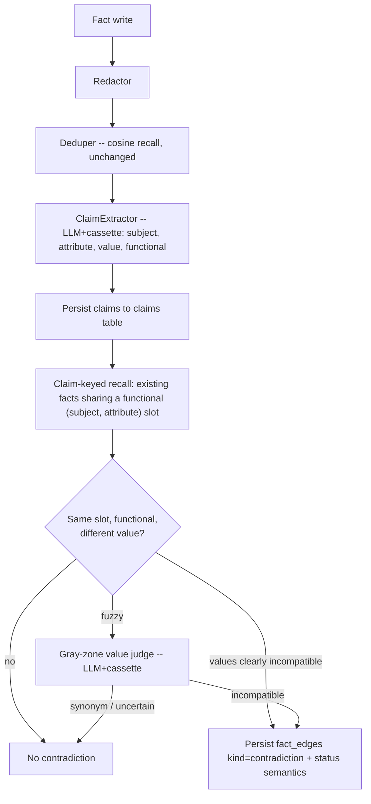

# feat: Structural (subject, attribute, value) contradiction detection

## Summary

Replace the contradiction-detection path — currently a cosine-similarity recall pass
feeding a bare-boolean LLM judge per candidate — with a structured detector. Each fact is
decomposed at write time into atomic **(subject, attribute, value)** claims tagged with a
**functional** (single-valued) flag. A contradiction is recorded only when two facts share a
subject and a *functional* attribute with **incompatible values**. Detection is precision-first
(suppress on uncertainty); an LLM is used only to extract claims (once per fact, cassette-cached)
and to settle fuzzy value-equality in the narrow gray zone. Existing resolution semantics and the
contradictions tab are preserved; the tab groups conflicts into one item per slot. A backfill
migration re-evaluates existing graphs, clearing structural false positives.

Validated by a session spike (`scratchpad/spike_sav_contradiction.py`, real `gpt-4o-mini`
extraction over the 18 facts behind the 12 `volta_video` flags): false positives 9 → 0, the real
voltaic-pile-year conflict collapsed into one 5-fact cluster.

---

## Problem frame

On each write the store runs one cosine recall pass (`PostgresVectorGraph._recall`, floor 0.45)
and `ConflictFlagger` asks `ConflictJudge` ("Does NEW contradict EXISTING?") for every candidate,
emitting a `contradiction:<id>` flag per pair (persisted as a `fact_edges` row, `kind='contradiction'`).
This measures **topical similarity**, not contradiction. On the live `volta_video` graph: 12 flagged
pairs, **9 false positives** (topically-related-but-non-opposing facts), and the **1 real** conflict
(voltaic-pile year 1799/1800/1801) fragmented across 3 redundant pairs.

The repo's own archived findings confirm the root cause: "cosine is a topicality funnel, not a
relationship detector" (negation-insensitive embeddings score contradictions 0.77–0.89); HyDE/counter-claim
recall was tried and failed; NLI cross-encoders over-trigger without a subject gate. The fix is to
detect on structure — a functional-dependency violation over extracted claims — not on text similarity.

---

## Requirements

Carried from origin (`docs/brainstorms/2026-06-23-contradiction-detection-requirements.md`):

- **R1** Claim-based representation: facts decomposed into (subject, attribute, value) claims at write time, each tagged functional vs multi-valued.
- **R2** Structural definition: contradiction = same subject + same functional attribute + incompatible value. Multi-valued attributes never conflict on value difference.
- **R3** Precision-first: suppress (do not flag) when extraction confidence, functional status, or value incompatibility is uncertain.
- **R4** Narrow gray-zone LLM check: used only to decide same-slot value incompatibility (synonym vs genuine conflict), never whether two facts relate; uncertain verdict → suppress.
- **R5** Clustered surfacing: all facts competing for one slot shown as a single contradictions-tab item.
- **R6** Resolution semantics unchanged (proposed + in-contradiction; human vetting; no auto-resolution).
- **R7** Backfill + re-evaluate existing graphs; structural false positives auto-clear, real conflicts re-surface as clusters.
- **R8** Replace the existing cosine + bare-boolean path outright (not gated alongside).
- **R9** Efficiency: common-case detection is an index lookup with zero LLM calls; LLM limited to R4 and to cacheable per-fact extraction; no O(candidates) LLM calls per write.

---

## Key technical decisions

- **KTD1 — Separate `claims` table, not columns on `facts`.** A fact has many claims (the spike
  extracted 5–10 per wiki paragraph), so claims are a one-to-many child table:
  `claims(org_id, user_id, fact_id, subject, attribute, value, functional, …)` with a
  `cached_claims` twin for snapshot/eval parity (mirroring the `facts`/`cached_facts` split). Indexed on
  the normalized `(org_id, user_id, subject, attribute)` slot key for zero-LLM lookup (R9). Rationale:
  facts↔claims is one-to-many; packing into `facts` columns can't represent it and breaks the slot index.
  (see origin open question: claim/slot storage shape)
- **KTD2 — Extend the existing write-step + cassette pattern, don't reinvent.** Add a `ClaimExtractor`
  write step mirroring `AspectTagger`, and a claim-extraction cassette mirroring `IngestionCassette`
  (`sha256(model + "\n" + fact_text) → claims`), committed, loud-miss, `--refresh` regenerator. The
  gray-zone value check (R4) reuses the `VerdictCassette` + structured-output `_SCHEMA` shape from
  `ConflictJudge`/`MergeJudge`. Rationale: structured verdicts + cassettes already exist; determinism
  is mandatory or eval CI breaks (OpenRouter is nondeterministic even at temp 0).
- **KTD3 — Detection via (subject, attribute) blocking, replacing cosine recall for the conflict path.**
  Add a claim-keyed recall (`claim_candidates`) to `WriteDecision`, filled in `_recall` mirroring the
  existing `tag_candidates` block: recall existing facts sharing a functional slot, then check value
  incompatibility. Rationale: archived findings name multi-key blocking as the proven recall lever;
  cosine is removed from the conflict path (R8) but remains for the dedup/Deduper path untouched.
- **KTD4 — Keep persisting `fact_edges(kind='contradiction')`.** The new detector emits the same edge
  shape via the existing `_persist_contradictions`, so `FactsCandidates.contradictions()`, the resolve
  flow, and the frontend keep working unchanged (R6). Rationale: smallest blast radius; resolution is
  explicitly out of scope.
- **KTD5 — R5 clustering is display-layer grouping over `fact_edges`, keyed by claim slot.** The
  contradictions API groups pairs sharing a `(subject, attribute)` slot (looked up from `claims`) into
  one cluster item; no new persisted cluster entity, and the shipped embedding `cluster_id` is **not**
  overloaded. Rationale: origin call-out confirmed; avoids a second meaning of "cluster."
- **KTD6 — Precision-first suppression is the backstop for extraction quality.** When extraction is
  low-confidence, functional status is unclear, or the gray-zone judge is uncertain, no edge is written
  (R3). Rationale: claim-extraction quality is the central risk (the spike's one missed conflict came
  from subject mis-canonicalization); suppression keeps precision high even when extraction is imperfect.

---

## High-Level Technical Design

Write-time detection flow (replaces the cosine→bare-LLM conflict path; dedup path unchanged):



Surfacing (read path): `GET /contradictions` groups `fact_edges` pairs by shared claim slot (KTD5)
into one cluster per slot; the tab renders one card per cluster instead of one per pair.

---

## Output Structure

New files (claims store + new write steps + extraction cassette + migration + eval cases). Existing
files modified are listed per unit.

```
knowledge/
  knowledge_graph/write_policy/write_step_variants/
    claim_extractor.py        # NEW  (ClaimExtractor + ClaimExtractionJudge)
    claim_conflict_detector.py # NEW (ClaimConflictDetector + ClaimValueJudge)
  llm/
    claim_cassette.py         # NEW  (per-fact extraction replay; mirrors IngestionCassette)
migrations/
  m2026_06_24_claims_backfill.py  # NEW
knowledge/evals/cases/matt/
  claim_fd_year_conflict/     # NEW  (AE1)
  claim_no_conflict_distinct_subjects/ # NEW (AE2)
  claim_no_conflict_multivalued/       # NEW (AE3, AE4)
  claim_gray_zone_synonym/    # NEW  (AE5)
```

---

## Implementation Units

### U1. Claims data model and storage

**Goal:** Persist atomic claims as a first-class child of facts, with snapshot/eval parity and a slot index.
**Requirements:** R1, R9 (slot index enables zero-LLM lookup).
**Dependencies:** none.
**Files:**
- `knowledge/serve/schema.sql` (add `claims` + `cached_claims` DDL, idempotent `IF NOT EXISTS`; slot index on `(org_id, user_id, subject, attribute)`)
- `knowledge/knowledge_graph/knowledge_graph_def.py` (add `Claim` model; optionally `Fact.claims` accessor)
- `knowledge/knowledge_graph/knowledge_graph_variants/postgres_vector_graph.py` (claim writer; extend `_FACT_COPY_COLS`-style copy so cache snapshots carry claims losslessly)
- `knowledge/knowledge_graph/knowledge_graph_variants/vector_graph.py` (in-memory claims for the offline/eval path)
- `knowledge/knowledge_graph/tests/test_postgres_vector_graph.py`, `knowledge/tests/test_vector_graph.py`
**Approach:** Mirror the `facts`/`cached_facts` pair exactly, including `cache_key` on the cached twin and lossless copy into snapshots/eval cache. `functional` is a boolean column; `subject`/`attribute` stored normalized (lowercased, whitespace-collapsed) for slot matching, raw value retained. Claims are deleted/rewritten when their parent fact is rewritten.
**Patterns to follow:** the shipped clustering columns (idempotent ALTER + `_FACT_COPY_COLS` parity) and the `cached_facts` mirror; `facts.state` precedent (bare text, data updates not enums).
**Test scenarios:**
- Happy: writing a fact persists its claims; reading back returns them with `functional` intact.
- Edge: a fact with zero extractable claims persists no claim rows and is not an error.
- Edge: rewriting a fact replaces (not duplicates) its claims.
- Integration: snapshotting/eval-caching a graph round-trips claims into `cached_claims` losslessly (Covers R7 parity).
**Verification:** schema bootstraps idempotently; a fact's claims survive a snapshot→restore round-trip.

### U2. Claim extraction write step + cassette

**Goal:** Extract (subject, attribute, value, functional) claims from each fact deterministically.
**Requirements:** R1, R3 (extraction confidence drives suppression), R9 (cacheable, once per fact).
**Dependencies:** U1.
**Files:**
- `knowledge/knowledge_graph/write_policy/write_step_variants/claim_extractor.py` (NEW: `ClaimExtractor` write step + `ClaimExtractionJudge`)
- `knowledge/llm/claim_cassette.py` (NEW: per-fact extraction replay)
- `knowledge/knowledge_graph/write_policy/write_policy_def.py` (add `claims`/`claim_candidates` fields to `WriteDecision`)
- `knowledge/knowledge_graph/write_policy/tests/test_claim_extractor.py` (NEW)
**Approach:** Mirror `AspectTagger`: structured `_SCHEMA` with `claims: [{subject, attribute, value, functional}]`; cassette → live → `None`-skip graceful degradation. Prompt instructs canonical subject assignment (an event's year belongs to the event, not the actor — the spike's key fix), specific attributes, normalized values, and the functional/multi-valued judgment. Cassette keyed `sha256(model + "\n" + fact_text)`, committed, loud-miss, with a `--refresh` regenerator; record extraction cassette before embeddings (ingestion-cassette ordering rule).
**Patterns to follow:** `aspect_tagger.py` (write step + judge + cassette + graceful skip); `IngestionCassette` (str→str keyed replay, refresh ordering).
**Execution note:** Start with a failing test pinning the extraction schema + cassette replay against a recorded fixture, since determinism is the central risk.
**Test scenarios:**
- Happy: a dated-event fact yields a claim with the event as subject, `invention year` as a functional attribute, year as value.
- Edge: a multi-claim paragraph yields multiple claims; a fact stating someone's discoveries marks `discovery` non-functional (Covers AE3).
- Error: no LLM and no cassette → step is inert (no claims, no raise); stale cassette → loud miss.
- Edge: low-confidence/garbled extraction yields no claims rather than guesses (R3).
**Verification:** extraction replays identically from the cassette; offline eval runs need no API key.

### U3. Claim-keyed recall

**Goal:** Surface existing facts that share a functional slot with the incoming fact's claims.
**Requirements:** R2, R9.
**Dependencies:** U1, U2.
**Files:**
- `knowledge/knowledge_graph/knowledge_graph_variants/postgres_vector_graph.py` (`_recall`: add claim-slot recall populating `decision.claim_candidates`)
- `knowledge/knowledge_graph/knowledge_graph_variants/vector_graph.py` (in-memory equivalent)
- `knowledge/knowledge_graph/tests/test_postgres_vector_graph.py`, `knowledge/tests/test_vector_graph.py`
**Approach:** Mirror the existing `tag_candidates` recall block. For each functional claim on the incoming fact, look up other active facts holding a claim on the same normalized `(subject, attribute)` slot (index from U1). Returns candidate facts plus the matched slot, so U4 can compare values without re-deriving. Zero LLM calls.
**Patterns to follow:** the `tag_candidates` second-recall-key block in `_recall`; `consumes_candidates` filling convention.
**Test scenarios:**
- Happy: a fact asserting `(voltaic pile, invention year)` recalls existing facts on that slot (Covers AE1).
- Edge: facts sharing only a subject but not an attribute (or only a non-functional attribute) are not recalled (Covers AE4).
- Edge: no existing slot match → empty candidate set, no error.
**Verification:** the year-asserting volta facts mutually recall on the slot; the Galvani/Volta facts do not share a slot.

### U4. Structural conflict detector + gray-zone value judge

**Goal:** Decide and record contradictions from claim slots, precision-first.
**Requirements:** R2, R3, R4, R6 (emits the existing edge/status path).
**Dependencies:** U3.
**Files:**
- `knowledge/knowledge_graph/write_policy/write_step_variants/claim_conflict_detector.py` (NEW: `ClaimConflictDetector` + `ClaimValueJudge`)
- `knowledge/knowledge_graph/write_policy/write_policy_def.py` (reuse `flags`; no schema change)
- `knowledge/knowledge_graph/knowledge_graph_variants/postgres_vector_graph.py` (`_persist_contradictions` reused unchanged)
- `knowledge/knowledge_graph/write_policy/tests/test_claim_conflict_detector.py` (NEW)
**Approach:** For each `claim_candidate` slot match: if values are clearly equal → no conflict; clearly different (e.g. normalized year tokens) → record `contradiction:<id>`; fuzzy → call `ClaimValueJudge` (LLM + `VerdictCassette`, structured `{incompatible}`) asking only "are these two values for the same property incompatible or synonymous?". Uncertain or no-judge → suppress (R3). Recorded flags flow through the existing `_persist_contradictions` → `fact_edges` → status semantics (R6). Replaces `ConflictFlagger`'s judgment role.
**Patterns to follow:** `conflict_flagger.py` (flag emission + `_persist_contradictions` handoff), `conflict_judge.py`/`merge_judge.py` (structured verdict + cassette + graceful skip).
**Test scenarios:**
- Happy: same slot, values 1799 vs 1800 → contradiction recorded (Covers AE1).
- Happy: "first electric battery" vs "early electric battery" on the same slot → gray-zone judge returns synonym → no contradiction (Covers AE5).
- Edge: distinct subjects ("Galvani discovered…" vs "Volta disproved…") → no contradiction (Covers AE2).
- Edge: non-functional attribute with different values → no contradiction (Covers AE3).
- Error: gray-zone judge unavailable or uncertain → suppress, no edge written (R3).
- Integration: a recorded contradiction creates a `fact_edges` row and applies proposed/in-contradiction status exactly as the old path did (Covers R6).
**Verification:** on the spike's 18 facts, false positives are 0 and the year conflict is detected.

### U5. Wire the replacement; remove the old path

**Goal:** Make the structural detector the default and retire the cosine + bare-boolean conflict path (R8).
**Requirements:** R8.
**Dependencies:** U2, U3, U4.
**Files:**
- `knowledge/knowledge_graph/knowledge_graph_variants/postgres_vector_graph.py` (`default_write_policy`: `[Redactor, Deduper, ClaimExtractor, ClaimConflictDetector]`)
- `knowledge/knowledge_graph/knowledge_graph_variants/vector_graph.py` (same)
- `knowledge/evals/run.py` (repoint the `conflict_model` axis + capability gates to the new steps; remove `ConflictFlagger`/`AspectTagger`-conflict wiring)
- Delete `knowledge/knowledge_graph/write_policy/write_step_variants/conflict_flagger.py`, `conflict_judge.py` and their tests (`test_conflict_flagger.py`); update any imports
- `knowledge/serve/regenerate.py` / wiring touchpoints if they reference the removed steps
**Approach:** Swap the default policy in both stores. Update the eval harness so existing contradiction cases run through the new detector (their capability gate becomes "claim extraction + value verdict cassettes present"). Remove the dead steps and references. Deduper/cosine path stays for dedup.
**Patterns to follow:** `default_write_policy()` assembly; `_conflict_judge_for`/`_build_trio_for` wiring in `run.py`.
**Test scenarios:**
- Happy: a write through the default policy runs extraction → detection and records no `ConflictJudge` call.
- Integration: existing contradiction eval cases (`subtle_contradiction_utc_local`, `contradiction_incumbent_vs_newcomer`, `contradiction_both_newcomers`, `apparent_conflict_env_scoped`) pass under the new wiring or are updated with rationale.
- Edge: no removed-symbol import remains (grep clean).
**Verification:** test suite green with old steps deleted; eval contradiction cases pass.

### U6. Clustered surfacing in the contradictions tab

**Goal:** Show one item per conflicting slot instead of N pairwise rows (R5).
**Requirements:** R5, R6 (resolve flow unchanged).
**Dependencies:** U1, U4.
**Files:**
- `knowledge/serve/contradiction_adapter.py` (`serialize_pairs`: group pairs by shared claim slot into cluster items)
- `knowledge/serve/facts_candidates.py` (`contradictions()` returns clustered shape; `_rival_map` unchanged)
- `knowledge/serve/app.py` (`GET /contradictions` response carries clusters; resolve endpoint unchanged)
- `frontend-react/src/components/ContradictionsReview.tsx` (render one card per cluster; `uniqueContradictionPairs` → cluster buckets)
- `frontend-react/src/api/apiClient.ts`, `frontend-react/src/types/candidate.ts` (cluster-shaped type)
- `knowledge/serve/tests/test_facts_candidates.py`, frontend component test
**Approach:** Look up each contradiction pair's slot from `claims` (KTD5); group pairs sharing a slot into one cluster listing all competing facts/values. Resolution still operates pair-wise underneath (keep A / keep B / custom) — clustering is presentation only, so the resolve API and semantics are untouched (R6). Backward-compatible: a 2-fact conflict is a cluster of size 2.
**Patterns to follow:** `serialize_pairs` canonical sorted-id pairing; `ContradictionsReview` card rendering.
**Test scenarios:**
- Happy: three facts on one slot (1799/1800/1801) serialize to one cluster of three (Covers AE1, R5).
- Edge: two independent conflicts on different slots → two separate clusters.
- Edge: a single pair → cluster of size 2 (no regression).
- Integration: resolving one fact within a cluster uses the existing resolve endpoint and updates the cluster on refetch (Covers R6).
**Verification:** the volta year conflict renders as one tab card; resolving still works.

### U7. Backfill + re-evaluate migration

**Goal:** Extract claims for existing facts, recompute contradiction edges, clear structural false positives (R7).
**Requirements:** R7.
**Dependencies:** U1–U4.
**Files:**
- `migrations/m2026_06_24_claims_backfill.py` (NEW)
- `knowledge/serve/tests/` migration smoke test (or a dry-run mode)
**Approach:** Follow `m2026_06_23_unify_facts.py`: `load_dotenv()` → `connect()` → idempotent, guarded steps with printed per-step summary. For every existing fact (live and `cached_facts`/eval snapshots): extract claims (cassette-backed for determinism), populate `claims`/`cached_claims`, then recompute `fact_edges(kind='contradiction')` from the new detector — adding newly-found real conflicts and **deleting edges the structural detector no longer supports** (clearing the 9 `volta_video` false positives). Re-evaluation only touches contradiction edges; it does not change fact `state` beyond what the detector's status rules dictate, and never auto-resolves (R6). Round-trip the `eval:<case_id>` cache losslessly.
**Execution note:** Add characterization coverage of current edges before mutating, so the diff (which edges added/removed) is auditable.
**Test scenarios:**
- Happy: backfill over a fixture graph populates claims and recomputes edges.
- Edge: re-running the migration is idempotent (no duplicate claims/edges).
- Integration: backfill over the `volta_video` eval snapshot clears the 9 false-positive edges and leaves the year conflict as one cluster (Covers AE6, R7).
- Edge: facts with no extractable claims are skipped without error.
**Verification:** post-backfill `volta_video` shows ~0 false positives and one year cluster; migration is idempotent.

### U8. Eval cases and success metrics

**Goal:** Lock the behavior with deterministic eval cases grounded in the acceptance examples.
**Requirements:** R2–R5 (behavioral guarantees), success criteria.
**Dependencies:** U2–U6.
**Files:**
- `knowledge/evals/cases/matt/claim_fd_year_conflict/case.yaml` (AE1)
- `knowledge/evals/cases/matt/claim_no_conflict_distinct_subjects/case.yaml` (AE2)
- `knowledge/evals/cases/matt/claim_no_conflict_multivalued/case.yaml` (AE3, AE4)
- `knowledge/evals/cases/matt/claim_gray_zone_synonym/case.yaml` (AE5)
- extraction + value-verdict cassette fixtures (new dirs under the eval fixtures/verdict-cache convention)
- `knowledge/evals/deterministic_checks/text.py` (reuse/extend the `CONTRADICTION:` grep checks)
**Approach:** Each case seeds the relevant facts (`seeded_insight.direct_to_graph` / `via_ingestor`), runs through the new policy with extraction + value cassettes, and asserts via deterministic checks on a `_contradictions_summary`-style render. Cases live under `matt/` per convention. Success metrics: `volta_video` false positives 9→~0; the year conflict surfaces as one cluster; no regression on the four existing contradiction cases; zero LLM calls on the no-conflict cases (assert via cassette miss-counting or call counter).
**Patterns to follow:** existing `matt/` contradiction cases (`apparent_conflict_env_scoped` etc.); `_contradictions_summary`; verdict cassette dirs.
**Test scenarios:**
- AE1: year conflict → one cluster of competing values.
- AE2: distinct subjects → no contradiction.
- AE3/AE4: multi-valued attribute / sequential roles → no contradiction.
- AE5: synonym values → no contradiction (gray-zone judge).
- Metric: no-conflict cases make zero structural-detector LLM calls beyond cached extraction (R9).
**Verification:** all new cases pass deterministically offline; existing cases still pass.

---

## Phased delivery

1. **Foundation** — U1 (claims store), U2 (extraction + cassette).
2. **Detection** — U3 (claim recall), U4 (detector + gray-zone judge).
3. **Cutover** — U5 (replace + remove old path).
4. **Surface + data** — U6 (clustered tab), U7 (backfill).
5. **Lock-in** — U8 (eval cases + metrics).

---

## Risks and mitigations

- **Claim-extraction quality (central risk).** Mis-canonicalized subjects split real conflicts (the
  spike's one miss); collapsed attributes create spurious slots. Mitigation: precision-first suppression
  (R3/KTD6), an extraction prompt that pins canonical subject + functional judgment, cassette-pinned
  determinism, and eval cases (U8) that would catch regressions.
- **Determinism breakage.** OpenRouter varies at temp 0; an uncassetted extraction makes evals
  unattributable and breaks the embedding cache. Mitigation: claim cassette (KTD2), record-before-embed
  ordering, loud-miss.
- **Recall loss vs today.** Structural detection can miss genuine conflicts that share no clean slot
  (implicit/cross-vocabulary). Accepted per precision-first posture and origin scope (deferred). Mitigation:
  U8 guards no regression on the existing contradiction cases.
- **Backfill mutating edges.** Deleting edges could remove a real conflict if extraction underperforms on
  an existing fact. Mitigation: characterization of current edges before mutation (U7 execution note),
  idempotent re-runnable migration, eval-cache round-trip check.

---

## Scope boundaries

### In scope
Claim extraction + functional tagging (U1–U2), structural same-slot detection with suppression (U3–U4),
gray-zone value check (U4), replacement of the old path (U5), clustered surfacing (U6), backfill (U7),
eval cases (U8).

### Deferred for later (from origin)
- Implicit / cross-vocabulary contradiction detection (the Tier-B `AspectTagger` premise) — inherently low-precision; do **not** reintroduce.
- Auto-resolution / automatic graph mutation of winners — resolution stays human-driven (R6).
- Embedding / recall-floor retuning for the dedup path.

### Outside this product's identity (from origin)
- Treating disagreements between different entities' claims as graph contradictions (recording that two historical figures disagreed is not a contradiction).

### Deferred to follow-up work
- Eventual unification of the keyed-replay cassettes (embedding, ingestion, merge, conflict, extraction) once the shared abstraction earns its keep — noted by prior art, not part of this plan.

---

## System-wide impact

- **DB:** new `claims`/`cached_claims` tables; backfill over live + cached/eval data. Multi-tenant by `(org_id, user_id)`.
- **Write path:** default policy changes for every fact write; extraction adds one cacheable LLM call per new fact, removes O(candidates) conflict-judge calls (net efficiency gain, R9).
- **Frontend:** contradictions tab renders clusters; resolve flow unchanged.
- **Evals:** conflict-case wiring repointed; new cassettes committed.

---

## Sources & research

- Origin requirements: `docs/brainstorms/2026-06-23-contradiction-detection-requirements.md`; ideation: `docs/ideation/2026-06-23-contradiction-detection.md`; spike: `scratchpad/spike_sav_contradiction.py` (9→0 FPs validated).
- Prior art (extend, don't reinvent): `docs/proposals/completed/2026-06-22-unified-dedup-conflict-recall.md`, `…/2026-06-22-semantic-dedup-recall-gate-llm-judge.md`, `…/2026-06-22-deterministic-ingestion-cassette.md`; cosine-funnel findings: `docs/proposals/archive/2026-06-22-dedup-conflict-handoff.md`; resolution lifecycle (preserve): `docs/proposals/2026-06-23-fact-rejection-contradiction-lifecycle.md`.
- External (session research, load-bearing): functional-dependency / SHACL functional-property violation as the contradiction primitive; NLI cross-encoders over-trigger without a subject gate (verify-only); FACTTRACK temporal-interval gating; Atomic-SNLI atomic decomposition. Corroborated by the repo's archived HyDE-failure and cosine-funnel findings.
