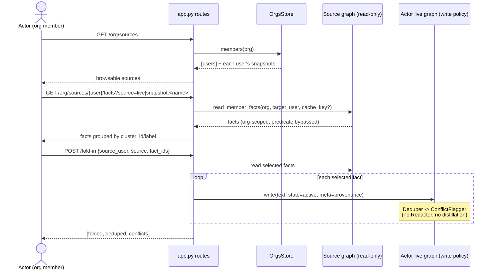

# feat: Skill Sharing — Browse & Fold-In

## Summary

Let any org member open another source in their org — a teammate's live graph or
any saved snapshot — browse it grouped by cluster/skill, cherry-pick the ideas
they want (cluster-default, fact-override), and **fold the selection into their
own live graph**, deduped and conflict-flagged against what they already have.

A "skill" is not a distinct entity: it is a cluster of atomic `facts` grouped by
`cluster_id` / `cluster_label`. "Sharing a skill" = copying a selected subset of
facts across a user/cache boundary. This plan reuses the existing snapshot/cache
machinery (`save_cache`/`merge_caches_into_live`), the write-policy components
(`Deduper`, `ConflictFlagger`), and the clustering labels already persisted on
facts. The one genuinely new surface is an **org-scoped read path** that lets a
member read another member's facts (today's predicate
`org_id = ? AND (shared OR user_id = ?)` hides them).

---

## Problem Frame

Good skills stay siloed in whoever's graph (or snapshot) first ingested them.
There is no user-facing path to (a) view another member's or snapshot's facts, or
(b) copy a selected subset into your own graph with dedup/conflict handling. The
schema supports multi-tenancy and snapshots, but no "browse a foreign set +
selectively fold in" workflow exists.

---

## Requirements

Carried from origin (`docs/brainstorms/2026-06-23-skill-sharing-fold-in-requirements.md`):

- **R1** — Any org member can browse any source in their org: a teammate's live
  graph, their own other snapshots, or any org snapshot. Source is read-only.
- **R2** — Browse view lists the source's facts grouped by cluster/skill,
  expandable to individual facts.
- **R3** — Selection defaults to the cluster (check a skill → all its facts);
  expanding a cluster allows fact-level select/deselect.
- **R4** — Fold-in copies selected facts into the actor's live graph as new facts
  they own, running them through `Deduper` + `ConflictFlagger` (no LLM
  distillation, no `Redactor`).
- **R5** — Dedup prevents duplicates when folding a skill already held; conflicts
  surface via the existing contradiction/flag path rather than silently
  overwriting.
- **R6** — Each folded fact carries provenance (origin user + source).
- **R7** — Fold-in is synchronous (no LLM round-trip required for the copy
  itself; conflict-flag judge calls are the existing behavior).

### Key Decisions (resolving origin Open Questions)

- **KTD1 — Folded facts land `active`.** Matches "explicit adds go active"; the
  skill is immediately retrievable. Conflicts are still flagged on the new fact
  (the flag does not depend on `proposed` state). Confirmed with user.
- **KTD2 — Cross-user access is org-scoped, any-member-reads-anyone.** No
  per-user opt-out gate. Authorization = org membership (reuse `active_org` /
  `OrgsStore.is_member`). Confirmed with user.
- **KTD3 — Provenance lives in `meta` JSON**, not a new column — avoids a
  migration and `meta` already carries dashboard fields. Shape:
  `meta.foldedFrom = {user_id, source}` where `source` is `"live"` or
  `"snapshot:<name>"`, plus `meta.foldedFromFactId = <original id>`.
- **KTD4 — Edges carry only when both endpoints are in the selection.**
  Nodes-only otherwise. Mirrors `merge_caches_into_live`'s node-by-id behavior.
- **KTD5 — Cluster integrity: keep the source `cluster_label` as provenance on
  the copied fact; do not re-cluster inline.** Re-homing is the separate
  define-pass (`recluster()`), out of scope here.
- **KTD6 — Copied facts get fresh `id`s** (new UUIDs) owned by the actor, so a
  later snapshot/dedup of the actor's graph behaves normally. Original id is kept
  in `meta.foldedFromFactId`.

---

## Scope Boundaries

**In scope**
- Org-scoped browse read path (live graph or snapshot of any member).
- Cluster-grouped browse payload.
- Fold-in copy through `[Deduper, ConflictFlagger]` with provenance.
- Frontend browse-source + cherry-pick UI.

**Deferred for later** (from origin)
- Reference/subscribe model and an org-level canonical skill library
  (Approach C) — a different product bet, not an extension of this one.
- Propagation of source edits to already-folded copies (copies drift by design).
- Cross-org sharing.
- Publish/opt-in or per-fact privacy controls (org is full-trust by decision).

**Deferred to Follow-Up Work** (plan-local)
- Inline re-clustering of the actor's graph after a fold-in (run existing
  `recluster()` out-of-band).
- Pagination of the browse payload for very large sources (v1 returns the full
  grouped set; revisit if a source exceeds a few hundred facts).

---

## High-Level Technical Design

The browse read path is the new primitive: a graph reader bound to
`(org, target_user)` that **omits the `shared OR user_id` clause** (org
membership is the only gate). Everything downstream reuses existing machinery.

---

## Implementation Units

### U1. Org-scoped cross-user read path

**Goal:** Read another org member's facts (live or snapshot) without the
owner/shared predicate, gated only by org membership.

**Requirements:** R1, KTD2

**Dependencies:** none

**Files:**
- `knowledge/knowledge_graph/knowledge_graph_variants/postgres_vector_graph.py`
- `knowledge/tests/test_postgres_vector_graph.py` (or nearest existing graph test module)

**Approach:**
- Add a read-only constructor path or factory that binds `(org_id, target_user_id)`
  and a flag (e.g., `org_read=True`) that replaces the read predicate
  `org_id = %s AND (shared OR user_id = %s)` with `org_id = %s AND user_id = %s`
  for an explicit target user. Keep the change confined to the SELECT predicate
  builder used by `all_facts`, `get_fact`, `_search_vec`, and the cache readers.
- Support reading from cache tables for a target user via the existing
  `cache_key` parameter (so a snapshot of another user is readable).
- Do **not** expose write methods on this path — it is read-only.

**Patterns to follow:** existing `live_graph(org, sub)` factory in
`knowledge/serve/app.py`; existing `cache_key` gating in the constructor.

**Test scenarios:**
- Reading member B's `active` facts from member A's org-scoped reader returns
  B's private (non-shared) facts. (Covers R1)
- The org-scoped reader scoped to org X never returns facts from org Y (tenant
  isolation preserved).
- Reading a `snapshot:<name>` cache for target user B returns B's cached facts.
- The org-scoped reader exposes no write/merge mutation against the target user.

**Verification:** A test proves A can list B's private facts within the same org
and cannot reach another org's data.

---

### U2. Source discovery + cluster-grouped browse endpoints

**Goal:** REST endpoints to (a) list browsable sources in the org and (b) return
a source's facts grouped by cluster.

**Requirements:** R1, R2, KTD5

**Dependencies:** U1

**Files:**
- `knowledge/serve/app.py`
- `knowledge/serve/graph_adapter.py` (reuse/extend cluster grouping)
- `knowledge/tests/test_app.py` (or nearest existing route test module)

**Approach:**
- `GET /org/sources` → list org members (via `OrgsStore.members`) and, per
  member, their snapshot names (`list_caches("snapshot:")` against that member).
  Returns `[{user_id, email, snapshots: [...]}]`. Exclude nothing — full trust.
- `GET /org/sources/{user_id}/facts?source=live|snapshot:<name>` → build the
  U1 org-scoped reader for the target user (+ `cache_key` when a snapshot),
  fetch facts, return them grouped by `cluster_id`/`cluster_label` (fall back to
  `scope`, then "ungrouped" for `cluster_id is None`). Reuse the grouping shape
  from `graph_adapter.graph_from_facts` / `fact_to_candidate`.
- Both gated by `active_org` (membership check already enforced there).

**Patterns to follow:** snapshot routes (`list_snapshots`, `load_snapshot`) and
the `active_org` / `current_user` dependencies in `knowledge/serve/app.py`;
`fact_to_candidate` for the per-fact read model (carry `cluster_id`,
`cluster_label`).

**Test scenarios:**
- `GET /org/sources` lists every member and their snapshots for the caller's org.
- `GET /org/sources/{B}/facts?source=live` returns B's facts grouped by cluster,
  each group expandable to facts. (Covers R2)
- Facts with `cluster_id is None` land in a stable "ungrouped" bucket.
- `source=snapshot:<name>` returns the snapshot's facts, not B's live graph.
- A non-member org in the header is rejected (401/403 via `active_org`).
- Caller requesting a user outside their org gets no data.

**Verification:** Caller can enumerate sources and retrieve a teammate's
cluster-grouped facts through the API.

---

### U3. Fold-in endpoint (copy through dedup + conflict-flag)

**Goal:** Copy selected source facts into the caller's live graph through a
distillation-free write policy, with provenance, landing `active`.

**Requirements:** R4, R5, R6, R7, KTD1, KTD3, KTD4, KTD6

**Dependencies:** U1, U2

**Files:**
- `knowledge/serve/app.py`
- `knowledge/knowledge_graph/knowledge_graph_variants/postgres_vector_graph.py`
  (only if a thin `write`-with-meta affordance is needed)
- `knowledge/tests/test_app.py`
- `knowledge/tests/test_fold_in.py` (new)

**Approach:**
- `POST /fold-in` body: `{source_user, source, fact_ids: [...]}`.
- Read the selected facts via the U1 org-scoped reader for `source_user`
  (+ snapshot cache_key when applicable).
- Build the caller's live graph with policy `[Deduper(judge=...), ConflictFlagger(judge=ConflictJudge(llm=...))]`
  — **no `Redactor`, no ingestor/distillation**. Foreign facts are already atomic.
- For each selected fact: `graph.write(fact.text, state="active", meta={...})`
  where `meta` carries `foldedFrom = {user_id: source_user, source}`,
  `foldedFromFactId = fact.id`, and the source `cluster_label` (KTD5). New UUID
  per fact (KTD6).
- Edges (KTD4): after writing, copy `fact_edges` from the source whose both
  endpoints are in `fact_ids`, remapping old→new ids; skip edges with an endpoint
  outside the selection.
- Return `{folded: n, deduped: n, conflicts: [{new_id, rival_id}]}` so the UI can
  surface what merged and what conflicts.
- Reuse the existing contradiction/flag surfacing — conflicts appear as
  `flags=["contradiction:<id>"]` on the new fact (existing dashboard path).

**Patterns to follow:** `default_write_policy` composition in
`postgres_vector_graph.py`; the `/insights` human-gated add path for how a
non-default policy is wired; `merge_caches_into_live` for id-remap/edge handling.

**Test scenarios:**
- Folding 3 selected facts writes 3 new caller-owned facts with fresh ids and
  `meta.foldedFrom`. (Covers R6)
- Folding a fact whose text the caller already holds dedups (no duplicate;
  `deduped` count reflects it). (Covers R5)
- Folding a fact that contradicts an existing caller fact flags
  `contradiction:<id>` on the new fact and reports it in `conflicts`, without
  overwriting. (Covers R5)
- Folded facts land `state="active"` and are returned by the caller's
  `active_facts()`. (Covers KTD1)
- Cluster-level selection (all fact_ids of a cluster) folds the whole skill;
  partial selection folds only the chosen facts. (Covers R3 at the API level)
- An edge between two selected facts is copied with remapped ids; an edge with
  one endpoint outside the selection is skipped. (Covers KTD4)
- No `Redactor` runs (a fact containing a token-like string is not redacted by
  this path) — confirms the policy composition.
- Folding from `source=snapshot:<name>` reads cached facts, not the source's live
  graph.

**Verification:** Caller folds a selected skill and immediately retrieves it;
duplicates dedup; contradictions surface as flags.

---

### U4. Frontend: browse-source + cherry-pick UI

**Goal:** UI to pick a source, browse it grouped by cluster, select
cluster-default / fact-override, and fold in.

**Requirements:** R2, R3, R4

**Dependencies:** U2, U3

**Files:**
- `frontend/services/data_provider.py` (extend `DataProvider` protocol)
- `frontend/services/api_client.py` (`ApiDataProvider`: add source/fold-in calls)
- `frontend/services/contract_v1.py` (request/response helpers)
- the dashboard view module that renders snapshots/candidates (attach the browse
  panel alongside the existing snapshot UI)
- `frontend/tests/` (nearest existing provider test module)

**Approach:**
- Extend the `DataProvider` protocol with `list_org_sources()`,
  `get_source_facts(user_id, source)`, and `fold_in(source_user, source, fact_ids)`.
- Implement them in `ApiDataProvider` over the U2/U3 routes (mirror existing
  `urllib`-based methods and `contract_v1` body builders).
- UI: source picker (member + their snapshots / their live graph) → cluster-
  grouped list with a checkbox per cluster (default unit) that expands to
  fact-level checkboxes (override) → "Fold into my graph" button → result toast
  showing folded / deduped / conflicts, routing conflicts to the existing
  contradictions surface.

**Patterns to follow:** existing `ApiDataProvider` candidate/promote/reject
methods and `contract_v1` builders; existing snapshot list/load UI wiring.

**Test scenarios:**
- `ApiDataProvider.list_org_sources()` parses the `/org/sources` payload into
  typed sources.
- `get_source_facts` returns facts grouped by cluster for rendering. (Covers R2)
- Selecting a cluster checkbox selects all its fact ids; deselecting one child
  leaves the rest selected (cluster-default, fact-override). (Covers R3)
- `fold_in` posts the selected ids and surfaces folded/deduped/conflict counts.
  (Covers R4)
- A fold-in returning conflicts routes the user to the contradictions view.

**Verification:** From the dashboard, a user browses a teammate's source, checks
a skill, folds it in, and sees the result.

---

## Risks & Dependencies

- **Predicate-bypass blast radius (U1).** The org-scoped reader must change *only*
  the read predicate and stay read-only; an accidental leak of the bypass into a
  write or cross-org path breaks tenancy. Mitigation: confine the flag to the
  SELECT predicate builder, no write surface, explicit cross-org isolation test.
- **Conflict-flag latency (U3).** `ConflictFlagger` makes LLM judge calls per
  candidate; folding a large selection could be slow. R7 ("synchronous") refers
  to the copy not requiring distillation — the conflict judge is existing
  behavior. Mitigation: keep selections reasonable; consider batching as
  follow-up if it bites.
- **Provenance in `meta` (KTD3)** is unindexed; fine for display, not for
  querying "everything folded from B." Acceptable for v1.

---

## Sources & Research

- Origin requirements: `docs/brainstorms/2026-06-23-skill-sharing-fold-in-requirements.md`
- Read predicate, cache methods, write-policy composition, clustering, and
  frontend provider surfaces confirmed against:
  `knowledge/knowledge_graph/knowledge_graph_variants/postgres_vector_graph.py`,
  `knowledge/knowledge_graph/write_policy/`, `knowledge/serve/app.py`,
  `knowledge/serve/graph_adapter.py`, `knowledge/knowledge_graph/clustering.py`,
  `frontend/services/`.
