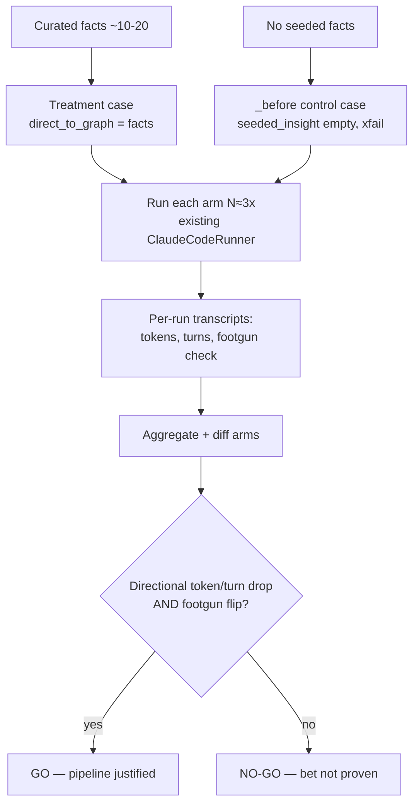

# feat: PR-knowledge dogfood experiment

## Summary

Build the cheapest experiment that proves or kills the bet behind
[the parent proposal](../proposals/2026-06-24-ingest-commits-and-prs.md): hand-curate ~10–20 facts
from recent merged Praxis PRs, push them into a coding agent's context, and A/B a small set of real
Praxis tasks — including one seeded footgun — on the **existing** eval harness. The harness already
injects seeded facts into the agent and already records tokens/turns/cost, so the work is authoring
paired eval cases on its established before/after convention plus one net-new piece: a multi-trial
aggregation that produces a go/no-go verdict.

---

## Problem Frame

The value claim — that past-PR knowledge helps a coding agent work faster/cheaper/better in this
repo — is currently illustrative-but-hypothetical (see origin). Building the full ingestion pipeline
(auto-distillation, contradiction/supersession, scope-aware retrieval) on that unvalidated bet risks
weeks of work that may not pay off. This experiment isolates the single unproven claim — *do these
facts help an agent at all* — from extraction quality and retrieval quality, cheaply, so the result
decides whether the rest gets built.

---

## Requirements

Carried from the origin proposal (R1–R8), refined with the resolved go-gate decision.

**Fact set**

- R1. Hand-curate ~10–20 high-signal facts from recent merged Praxis PRs (decisions, gotchas,
  conventions, rejected approaches). No auto-distillation.
- R2. Facts are pushed directly into the agent's context with no ranking or retrieval between the
  fact set and the agent.

**Task set**

- R3. A small set (~3–5) of representative real Praxis coding tasks.
- R4. At least one task is deliberately seeded so its footgun is documented in a real recent Praxis
  PR and the agent would plausibly hit it without the curated fact.

**Measurement**

- R5. Each task runs both arms — with curated facts, without — on the existing `ClaudeCodeRunner`,
  identical in everything but the presence of the facts.
- R6. Token usage and turn count are captured per run and compared across arms.
- R7. Footgun-avoidance is captured: whether the with-facts arm avoids the seeded footgun the
  without-facts arm hits.

**Decision gate**

- R8. **Go** = a clear directional token/turn reduction on most tasks **and** the seeded-footgun case
  flipping control-FAIL → treatment-PASS, eyeballed across ~3 trials per arm (no fixed percentage
  threshold). A null result on either signal means the bet is not proven — do not proceed to the
  ingestion pipeline.

---

## Key Technical Decisions

- **Reuse the harness as-is; no core changes.** Research confirmed `seeded_insight.direct_to_graph`
  writes curated facts as active and the reader injects them into the agent via
  `--append-system-prompt`, and `_claude_usage()` already records `input_tokens` / `output_tokens` /
  `num_turns` / `cost_usd` per run. The experiment adds cases + analysis on top, not infrastructure.
- **Whole-file reader, no retrieval.** Cases use the whole-graph reader (as
  `lost_in_middle_reader_before` does) so *all* curated facts reach the agent unranked. Using the
  retrieving reader would re-introduce ranking/cutoff and confound "does the knowledge help" with
  "did retrieval surface it" — exactly what this experiment removes.
- **Before/after convention for the A/B.** Each task is a paired set: a treatment case (base name,
  `seeded_insight.direct_to_graph` = curated facts) and a `_before` control (empty `seeded_insight`),
  with identical `seed_prompt` and reader. The control is marked `xfail` because it is *expected to
  fail* the footgun check — a failing control is what proves the test discriminates (precedent: the
  expected-fail `lost_in_middle_reader_before` control). The empty-seed structure follows the
  `pathlib_preference{,_before}` cold-baseline pair (which is itself non-`xfail` — it asserts a
  default the agent already exhibits, a different control shape).
- **Footgun as a deterministic check.** Express footgun-avoidance as a deterministic check asserting
  absence of the blind-default pattern — reuse `knowledge.evals.deterministic_checks.text:forbids_substring`
  if the footgun is a substring; add a custom check only if it cannot be. Control fails it (XFAIL),
  treatment passes it.
- **Go gate: directional + footgun flip, ~3 trials/arm.** No fixed quantitative threshold; a clear
  win or a null is expected to be obvious at this scale. If trial-to-trial variance obscures the
  signal, raise the trial count rather than inventing a threshold post hoc.
- **Trial orchestration is a thin wrapper.** Run each arm N times by looping the existing
  `python -m knowledge.evals.run <case_id>` entry point (or a small `--trials` affordance), not by
  reworking the runner. Aggregation reads the per-run transcripts the harness already writes.

---

## High-Level Technical Design

The experiment is a paired-arm A/B with a trial loop feeding a single aggregation + gate:

All experiment cases live in one named subfolder under `knowledge/evals/cases/dom/` (e.g.
`knowledge/evals/cases/dom/pr_knowledge_dogfood/`).

---

## Implementation Units

### U1. Design the task set and footgun seed

- **Goal:** Decide the ~3–5 real Praxis tasks and designate ≥1 seeded-footgun task tied to a specific
  recent PR's gotcha. Document the hypothesis, each task's `seed_prompt`, and — for the footgun task
  — the exact blind-default pattern the control will hit and the fact that prevents it.
- **Requirements:** R3, R4.
- **Dependencies:** none.
- **Files:** `knowledge/evals/cases/dom/pr_knowledge_dogfood/README.md`.
- **Approach:** Pick tasks where a documented past decision plausibly changes the agent's path.
  Footgun candidates from recent history: the UMAP `n_neighbors` fix (commit `d892e88`, PR #57) and the
  Phoenix-tracing-at-import-time fix (commit `22db05f`). For the footgun task, the control must
  plausibly emit the blind default so the `_before` arm genuinely fails — and the blind-default
  pattern must land in a file the agent writes, since the footgun check grades the agent's written
  output (named file / box-sweep / final text), not its reasoning. Design the task to force that.
- **Patterns to follow:** the hypothesis/README framing in `docs/volta-style-eval.md`; per-owner
  suite READMEs under `knowledge/evals/cases/dom/`.
- **Test scenarios:** Test expectation: none — design artifact. Verification is the review in U3
  (control must fail the footgun check).
- **Verification:** README names the tasks, the footgun PR, the blind-default pattern, and the
  preventing fact; a reader can author the cases from it without further questions.

### U2. Curate the fact set

- **Goal:** Hand-pick ~10–20 concise, high-signal facts from recent merged Praxis PRs, written as
  plain strings ready for `direct_to_graph`. Must include the fact(s) that neutralize the seeded
  footgun from U1.
- **Requirements:** R1.
- **Dependencies:** U1 (footgun fact must be present).
- **Files:** facts embedded in the treatment case YAML(s) under
  `knowledge/evals/cases/dom/pr_knowledge_dogfood/`; optionally a shared `facts.md` in the subfolder
  documenting provenance (fact → source PR/commit).
- **Approach:** Favor durable knowledge (decisions, gotchas, conventions, rejected approaches); skip
  mechanical churn. Keep each fact one or two sentences. Record the source commit per fact for
  traceability.
- **Test scenarios:** Test expectation: none — curated content. Quality is gated at U5 (a null result
  with weak facts is about curation, not the bet — so curation quality is the bar here).
- **Verification:** Each fact traces to a real merged PR; the footgun-neutralizing fact is in the set.

### U3. Author the paired eval cases

- **Goal:** For each task, author a treatment case and a `_before` control following the harness
  convention, wired to the whole-file reader and the footgun deterministic check.
- **Requirements:** R2, R5, R7.
- **Dependencies:** U1, U2.
- **Files:** `knowledge/evals/cases/dom/pr_knowledge_dogfood/<task>/case.yaml` (treatment) and
  `.../<task>_before/case.yaml` (control), per task.
- **Approach:** Treatment carries `seeded_insight.direct_to_graph` = curated facts; control leaves
  `seeded_insight` empty. Both arms share an identical `seed_prompt` and set the required
  `target_commit` field — use the all-zeros placeholder `"0000000000000000000000000000000000000000"`
  (a full-pipeline case with no `component` fails schema validation without it; every existing agent
  case sets it). The whole-file reader is the `EvalCase` default, so **omit the `reader` field** and
  do **not** set `component` — setting `component` would skip the agent and capture zero tokens/turns.
  Mark the control `xfail` with a reason (it is expected to fail the footgun check). Footgun task adds
  a deterministic check for absence of the blind-default pattern (reuse `text:forbids_substring` if
  applicable). Set `needs: [sandbox, file_io]` so only `ClaudeCodeRunner` serves them.
- **Patterns to follow:** `knowledge/evals/cases/pathlib_preference{,_before}/` for the empty-seed
  full-pipeline pair and overall case structure (including the `target_commit` placeholder and the
  defaulted reader); `knowledge/evals/cases/dom/reader_cutoff/lost_in_middle_reader_before/` for the
  expected-fail `xfail` control posture **only** (not its reader/`component: graph_reader` wiring,
  which is a reader-only case with no agent); case schema and validation in
  `knowledge/evals/eval_def.py`.
- **Test scenarios:**
  - Covers R7. Footgun control (`<task>_before`): with no facts, the agent emits the blind-default
    pattern → footgun check fails → status XFAIL (expected).
  - Covers R7. Footgun treatment (`<task>`): with facts, the agent avoids the pattern → footgun check
    passes → status PASS.
  - Each case produces non-empty output (`builds:output_nonempty`) so a crash isn't read as a result.
  - Non-footgun tasks: at minimum a produced-output check on both arms (these tasks carry the
    quantitative signal, not a footgun assertion).
- **Verification:** Running the `_before` controls yields XFAIL and the treatments yield PASS on the
  footgun case; both arms run cleanly under `ClaudeCodeRunner`.

### U4. Build trial-orchestration and aggregation tooling

- **Goal:** A small script that runs each case N times via the existing entry point, extracts
  tokens/turns and the footgun check result from the per-run transcripts, diffs treatment vs control,
  and evaluates the R8 go-gate.
- **Requirements:** R6, R8.
- **Dependencies:** U3.
- **Files:** `knowledge/evals/cases/dom/pr_knowledge_dogfood/analyze.py` (or a thin module under
  `knowledge/evals/`); reads live transcripts from
  `knowledge/evals/results/runs/<run_id>/<case_id>.json`. Committed test fixtures for the aggregator
  live under `knowledge/evals/cases/dom/pr_knowledge_dogfood/fixtures/transcripts/` — the runs dir is
  gitignored (`.gitignore` lists `knowledge/evals/results/runs/`), so fixtures cannot live there.
- **Approach:** Loop `python -m knowledge.evals.run <case_id>` N≈3 times per case (or add a minimal
  `--trials` flag if cleaner — decide during implementation), then parse `raw_response` usage from
  each transcript per `_claude_usage()` shape (`input_tokens`, `output_tokens`, `num_turns`). Report
  per-task mean ± spread for each arm and the per-arm footgun outcome. Emit the go-gate evaluation:
  directional token/turn reduction on most tasks AND footgun flip. Note: each run writes its
  transcript under a `run_id` dir stamped only to the second, so the aggregator must key trials by
  `run_id` and filter to this experiment's case IDs — serial loops within the same second can collide
  on `run_id`, and a bare scan of the runs dir would sweep in unrelated prior runs.
- **Patterns to follow:** transcript shape and usage extraction in `knowledge/evals/claude_code.py`
  (`_claude_usage`, the `tracing.record_output` call); baseline aggregation in
  `knowledge/evals/results/baseline.jsonl`.
- **Test scenarios:**
  - Happy path: given fixture transcripts for both arms, the aggregator reports correct per-arm
    token/turn means and the correct delta direction.
  - Footgun flip: given a failing control transcript and a passing treatment transcript, the gate
    reports the flip as satisfied.
  - Edge: a missing or malformed transcript is surfaced as an error, not silently averaged in.
  - Edge: with N trials of high variance, the report shows spread so a noise-dominated result isn't
    presented as a clean win.
- **Verification:** Run against the committed fixture transcripts (under the experiment subfolder, not
  the gitignored runs dir) and confirm the go-gate verdict matches hand-computed expectations.

### U5. Run the experiment and write the go/no-go report

- **Goal:** Execute the full apparatus on real Claude Code runs and record the verdict.
- **Requirements:** R8.
- **Dependencies:** U3, U4.
- **Files:** `knowledge/evals/cases/dom/pr_knowledge_dogfood/RESULTS.md`.
- **Execution note:** This unit runs the real agent (cost/time scale with tasks × arms × trials) —
  keep the task set small. Validate each `_before` control actually fails before trusting the paired
  treatment's pass.
- **Approach:** Run all arms N≈3×, run U4's aggregation, and write a short RESULTS.md: per-task
  token/turn deltas, footgun outcomes, the go/no-go verdict, and — if NO-GO — whether the gap looks
  like weak curation vs. genuinely-unhelpful knowledge.
- **Test scenarios:** Test expectation: none — execution + reporting unit. The deterministic checks
  and U4 tooling are the verification surface.
- **Verification:** RESULTS.md states an unambiguous go/no-go against R8, backed by the per-arm
  numbers and footgun outcomes.

---

## Risks & Dependencies

- **Agent nondeterminism vs. ~3 trials.** Small token/turn deltas may not separate from run-to-run
  noise at 3 trials. Mitigation: lean on tasks with a large expected effect (the footgun task is
  binary, not noisy), report spread, and raise trial count if the quantitative signal is murky.
- **Curation quality is the dominant hidden variable.** Weak facts produce a null that's about
  curation, not the bet. Mitigation: curate high-signal facts (U2) and explicitly include the
  footgun-neutralizing fact.
- **Footgun must genuinely tempt the blind default.** If the agent avoids the footgun even without
  the fact, the control won't fail and the pair proves nothing. Mitigation: the `_before` xfail
  discipline — confirm the control fails before trusting the treatment's pass (U3, U5).
- **Cost/time of real runs.** Tasks × 2 arms × N trials of real Claude Code. Mitigation: keep the
  task set at ~3–5.
- **Dependencies:** working `claude` CLI for `ClaudeCodeRunner`; `uv` env; `.env` per repo
  conventions. A rubric judge (and thus `OPENROUTER_API_KEY`) is likely unnecessary — deterministic
  footgun checks plus token/turn metrics carry both required signals.

---

## Scope Boundaries

Deferred behind this experiment's result (see origin and the parent proposal):

- Auto-distillation (`CommitIngestor`) — the next slice, gated on a GO
  ([2026-06-24-pr-knowledge-auto-distill-slice.md](../proposals/2026-06-24-pr-knowledge-auto-distill-slice.md)).
- The contradiction/supersession "currency" angle.
- Two-lane scope-aware retrieval changes.
- Auto-supersede write policy for code facts.
- Multi-tenant / tenant-facing product surface.
- Incremental ingestion trigger and the GitHub-migration interaction.
- Any change to the eval harness's core capture or runner — this experiment rides existing seams.

---

## Open Questions

Deferred to implementation:

- Trial mechanism: a shell/loop over the existing entry point vs. a minimal `--trials` flag (and how
  the aggregator keys trials by `run_id` to avoid collisions — see U4).
- Whether any rubric grading adds value beyond the deterministic footgun check + token/turn metrics
  (current assumption: no).
- Whether to keep the experiment cases in normal harness discovery (they SKIP on non-`ClaudeCodeRunner`
  backends but add CI noise) or mark them for exclusion from the baseline run.

---

## Sources / Research

- Origin proposal: `docs/proposals/2026-06-24-pr-knowledge-dogfood-experiment.md` (R1–R8).
- Case schema / loader: `knowledge/evals/eval_def.py` (EvalCase, SeededInsight, Rubric; note `reader`
  defaults to `whole_file` and component-less cases require `target_commit`);
  `knowledge/evals/run.py` (case load, `_seed_knowledge`, verdict `status_of`).
- Fact injection path: `seeded_insight.direct_to_graph` → graph write (active) → reader →
  `--append-system-prompt` in `knowledge/evals/claude_code.py`.
- Token/turn capture: `_claude_usage()` and `tracing.record_output` in
  `knowledge/evals/claude_code.py`; per-run transcripts under `knowledge/evals/results/runs/`.
- Before/after convention: `knowledge/evals/cases/dom/reader_cutoff/lost_in_middle_reader{,_before}/`
  (expected-fail `xfail` control); `knowledge/evals/cases/pathlib_preference{,_before}/` (empty-seed
  full-pipeline pair; note the all-zeros `target_commit` placeholder and defaulted reader).
- Deterministic checks: `knowledge/evals/deterministic_checks/` (`text:forbids_substring`,
  `builds:output_nonempty`).
- Run entry point: `python -m knowledge.evals.run <case_id>` (`--workers`, `--fake`, etc.).
