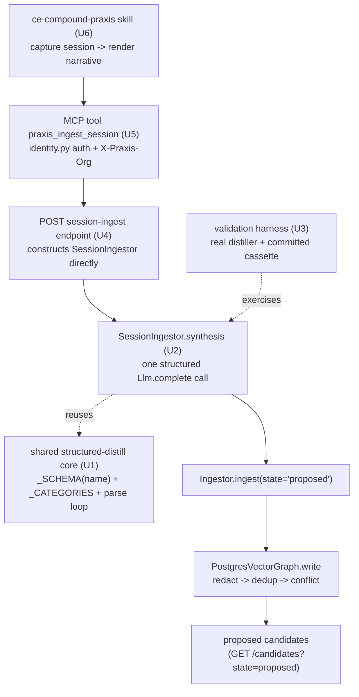

# feat: ce-compound-praxis session-ingestion bridge (write side)

## Summary

Build the write side of the `/ce-compound`→Praxis bridge: a `SessionIngestor` that distills a
solved-problem session narrative into typed `Insight[]`, a net-new backend endpoint that writes those
as `proposed` candidates, a thin MCP tool exposing it, and a repo-local `ce-compound-praxis` skill that
captures a session and feeds it through. A shared structured-distill core is extracted from
`CommitIngestor` first so the two variants can't drift. A real-distiller validation harness over a
committed gold-pairing fixture proves the bet before the skill lands. Retrieval / read-side is out of
scope (deferred in the origin).

---

## Problem Frame

`/ce-compound` is Praxis rebuilt as a markdown convention — it captures a solved problem at session end
and writes a flat doc to `docs/solutions/`, which nothing retrieves automatically. Praxis already has
the better machinery (graph-backed facts, dedup/conflict, a human-gated lifecycle, semantic retrieval)
and the exact extractor shape: `CommitIngestor` distills a unit into typed `{text, scope, category}`
insights with one structured LLM call. The origin proposal's thesis is that `/ce-compound` and
`CommitIngestor` are the same extractor reached from two triggers; this plan builds the session trigger
as a Praxis ingestion source rather than a parallel flat-file store. A write-side smoke test (origin's
Validation section) already cleared extraction quality on a real session, so the risk has moved
downstream (scope inference, granularity, experiment-state noise) — this plan builds against those
risks, not against "can it extract."

---

## Requirements

### Ingestor & shared core

- R1. A shared structured-distill module holds the JSON `_SCHEMA` (constructed per variant by name),
  the `_CATEGORIES` closed set (`decision | gotcha | convention | rejected`), and the precision-first
  parse scaffolding currently inline in `CommitIngestor.synthesis`. `CommitIngestor` is refactored onto
  it with **no behavior change** — its existing tests pass unmodified.
- R2. A `SessionIngestor(Ingestor)` variant distills a rendered session narrative into typed
  `Insight[]` via one structured `Llm.complete(...)` call with a session-framed prompt, reusing the R1
  module and inheriting `Ingestor.ingest`'s `state="proposed"` landing. Stamps `source="session/<id>"`.

### Backend write path

- R3. A net-new backend endpoint accepts a rendered session narrative plus a source identifier,
  constructs `SessionIngestor(graph, OpenRouterLlm())` directly over `PostgresVectorGraph`, and writes
  the distilled insights as `proposed` candidates. It reuses the `POST /ingest` request/response idiom
  and auth/org dependencies but not its `ingest_dump` wiring.
- R4. A thin MCP tool exposes R3 to a session — a near-clone of `praxis_ingest` targeting the new
  endpoint with `state="proposed"`, reusing the `identity.py` auth/org headers and fail-soft hints.

### Capture skill

- R5. A repo-local `ce-compound-praxis` skill captures a solved-problem session, renders a narrative
  from the same section structure `/ce-compound` extracts, and calls the R4 tool to write `proposed`
  candidates. It keeps a human-readable markdown doc as provenance (not the record).

### Validation

- R6. An offline unit suite for `SessionIngestor` (a scripted fake `Llm` + `InMemoryGraph`, mirroring
  `knowledge/injestion/tests/test_commit_injestor.py`) covers structured-reply→typed-insights, churn→`[]`,
  malformed-entry-dropped, and non-JSON→`[]`, keyed on the `SESSION NARRATIVE:` label.
- R7. A real-distiller validation harness runs `SessionIngestor` over a committed `fd866322`
  session-narrative fixture, gated by `OPENROUTER_API_KEY` presence plus a committed cassette (the
  structured-`complete` replay pattern via `CassetteLlm`), and asserts the three known downstream risks
  **provisionally**: near-duplicate over-emission is *tolerated* (the harness does not fail on >1
  phrasing of one lesson; dedup *absorption* is a live-`PostgresVectorGraph` property, not provable on
  the isolated `InMemoryGraph`), `scope` is inspected but not pinned to a fragile gold value, and
  experiment-state facts are counted against the proxy baseline (no more than the proxy's known set)
  rather than merely observed. It does not re-litigate extraction quality — the proxy already cleared it.

---

## Key Technical Decisions

- KTD1. **Route through the candidate lifecycle, not `/insights`.** Writes land `state="proposed"` via
  `Ingestor.ingest` so dedup, conflict, and the human gate apply. `POST /insights` hardcodes
  `state="active"` (`knowledge/serve/app.py`) and is the `add_insight` shortcut the origin explicitly
  rejects — the new path must not reuse it. (see origin: Key Decisions)
- KTD2. **One extractor, one schema, two prompts — with a parameterized schema name.** `_SCHEMA`,
  `_CATEGORIES`, and the parse loop move into one shared module. The schema `name` is currently
  `"pr_distillation"`; the shared builder takes the name as a parameter so `CommitIngestor` keeps
  `"pr_distillation"` (preserving its exact request payload) and `SessionIngestor` uses its own (e.g.
  `"session_distillation"`). Recommended shape: a thin `StructuredDistillIngestor` base both variants
  subclass, setting only their prompt, input label, and schema name.
- KTD3. **Net-new endpoint constructing `SessionIngestor` directly.** `build_trio` (`knowledge/wiring.py`)
  hardwires `PromptIngestor` with no ingestor-selection seam, and `POST /ingest` is bound to
  `ingest_dump`'s granular-claim distiller — neither runs the structured `_SCHEMA` extractor. The new
  endpoint constructs `SessionIngestor(graph, OpenRouterLlm())` directly, mirroring how `/ingest`
  constructs its collaborators per request.
- KTD4. **Backend distillation; client-side deferred.** The skill POSTs the rendered narrative; the
  distill `Llm.complete` call and the graph write run server-side, matching the deployed split (the MCP
  process holds no DB creds). The client-side "distill in-session, POST `Insight[]`" variant stays a
  deferred later option. (see origin: Key Decisions)
- KTD5. **A new repo-local skill, not edits to the installed `ce-compound`.** `ce-compound` is an
  installed plugin skill; `ce-compound-praxis` is authored in-repo under `.claude/skills/`, mirroring
  the existing `move-file` / `speckit-*` `SKILL.md` structure.
- KTD6. **Skill→backend via the MCP tool, not direct HTTP.** Authentication and org resolution live in
  `knowledge/mcp/identity.py`; routing the skill through the R4 tool reuses that credential path rather
  than re-implementing Cognito/token handling in skill instructions.
- KTD7. **Lifecycle is two-step `proposed → active`** (`_NEXT_STATE = {"proposed": "active"}` in
  `knowledge/serve/facts_candidates.py`) — the "suggested" intermediate was removed. This corrects the
  origin proposal's `proposed → suggested → active` wording; plan and code both target the two-step
  funnel.
- KTD8. **Validation isolates extraction, never masks the contract.** The harness pins the graph's
  dedup/write policy to a neutral double so it is sensitive only to extraction (isolation), and never
  softens the precision-first drop-malformed contract to make a fixture pass (masking). `scope`
  assertions are provisional because `scope` is the distiller's least-reliable column. (see
  `docs/solutions/conventions/gate-eval-experiment-plans-on-validated-footguns.md` and the
  eval-assert-actual-behavior convention)

---

## High-Level Technical Design

The write path, end to end. The shared core (U1) underlies both ingestor variants; everything right of
`SessionIngestor` reuses the existing proposed-candidate plumbing.

---

## Implementation Units

Sequenced to prove the bet before the user-facing trigger: shared-core refactor, the ingestor, the
validation harness (cheapest proof, needs only the ingestor), then the backend endpoint, the MCP tool,
and the skill last.

### U1. Extract the shared structured-distill core

- Goal: Factor `_SCHEMA`, `_CATEGORIES`, and the precision-first parse scaffolding out of
  `CommitIngestor` into a shared module, with zero behavior change, so `SessionIngestor` reuses them.
- Requirements: R1
- Dependencies: none
- Files:
  - `knowledge/injestion/injestor_variants/structured_distill.py` (new — shared `_CATEGORIES`, a
    `build_distill_schema(name)` factory, and a `StructuredDistillIngestor(Ingestor)` base implementing
    `synthesis` from class-attr prompt + input label + schema name)
  - `knowledge/injestion/injestor_variants/commit_injestor.py` (modify — subclass the base; keep
    `_DISTILL_PROMPT`, set input label `"UNIT INPUT"` and schema name `"pr_distillation"`; net deletion)
  - `knowledge/injestion/tests/test_commit_injestor.py` (unchanged — the behavior-preservation contract)
  - `knowledge/injestion/tests/test_structured_distill.py` (new — direct test of the base via a
    throwaway subclass)
- Approach: The base's `synthesis` builds `f"{self._DISTILL_PROMPT}\n\n{self._INPUT_LABEL}:\n{raw_input}"`
  — reproduce `CommitIngestor`'s current `"UNIT INPUT:"` string byte-for-byte so the schema/prompt
  payload is identical. The schema `name` is a parameter (KTD2), defaulting to nothing forced;
  `CommitIngestor` passes `"pr_distillation"`. The parse loop (`json.loads` in try/except → drop-empty
  `text` → coerce empty `scope`/`category` to `None` → build `Insight`) moves verbatim.
- Execution note: Characterization-style — `test_commit_injestor.py` must pass unmodified before and
  after; treat any required test edit as a signal the refactor changed behavior.
- Patterns to follow: `knowledge/injestion/parent_injestor.py` (the `Ingestor` ABC) and the current
  `commit_injestor.py` body.
- Test scenarios:
  - `test_commit_injestor.py` passes with no edits (behavior preserved) — happy path + the existing
    churn/malformed/non-JSON cases.
  - New: a throwaway `StructuredDistillIngestor` subclass with a trivial prompt + label distills a
    scripted two-insight reply into two typed `Insight`s with one structured call.
  - New: schema name parameter is reflected — `build_distill_schema("x")` yields a schema whose
    `json_schema.name == "x"`.
- Verification: `uv run pytest knowledge/injestion/tests/ -q` green with `test_commit_injestor.py`
  unmodified.

### U2. Add the `SessionIngestor` variant

- Goal: A `SessionIngestor` that distills a session narrative into proposed-bound `Insight[]`, differing
  from `CommitIngestor` only in prompt, input label, schema name, and class name.
- Requirements: R2, R6
- Dependencies: U1
- Files:
  - `knowledge/injestion/injestor_variants/session_injestor.py` (new)
  - `knowledge/injestion/tests/test_session_injestor.py` (new)
- Approach: Subclass `StructuredDistillIngestor`. Session-framed `_DISTILL_PROMPT` targeting the durable
  lesson, the gotcha, the decision/rationale, the convention, and explicitly rejected approaches;
  ignoring the play-by-play. Include the two prompt-guidance lines resolved in the origin's deferred
  questions: scope guidance ("the files a session names are where the lesson was *found*, not
  necessarily where it *applies*") and durable-vs-experiment-state guidance ("prefer durable
  code/architecture knowledge over an in-flight experiment's current state"). Input label
  `"SESSION NARRATIVE"`, schema name `"session_distillation"`. `source` flows as `"session/<id>"`.
- Patterns to follow: `commit_injestor.py` (post-U1) and `test_commit_injestor.py`'s `FakeLlm` +
  `InMemoryGraph` harness.
- Test scenarios (mirror `test_commit_injestor.py`, keyed on `SESSION NARRATIVE:`):
  - Happy path: a structured two-insight reply → two typed `Insight`s with `source="session/<id>"`,
    correct `scope`/`category`, exactly one structured call (`response_format` passed).
  - Edge — no durable knowledge: a play-by-play-only narrative → `[]`; a narrative naming a durable
    gotcha → one `gotcha` insight (key on a token present only in the narrative input).
  - Edge — malformed entry (missing `text`) dropped, well-formed sibling survives.
  - Error — empty/whitespace and non-JSON replies → `[]`, no raise.
- Verification: `uv run pytest knowledge/injestion/tests/test_session_injestor.py -q` green.

### U3. Real-distiller validation harness over the `fd866322` gold pairing

- Goal: Prove the bet — run the real `SessionIngestor` over the committed gold-pairing narrative and
  assert the three known downstream risks, gated for offline replay.
- Requirements: R7
- Dependencies: U2
- Files:
  - `knowledge/injestion/tests/fixtures/session_fd866322_narrative.md` (new — the rendered narrative,
    the same window used in the origin's smoke test)
  - `knowledge/injestion/tests/fixtures/session_ingestion/<model-slug>.json` (new — committed
    `CassetteLlm`-format cassette, recorded once with `OPENROUTER_API_KEY` set; a dir separate from the
    eval harness's `INGEST_CACHE_DIR` to avoid a slot collision on the same model slug)
  - `knowledge/injestion/tests/test_session_validation.py` (new)
- Approach: Drive `SessionIngestor` with `CassetteLlm(OpenRouterLlm(), cassette_path, allow_compute=bool(OPENROUTER_API_KEY))`
  (`knowledge/llm/llm_cassette.py`) — `CassetteLlm` is an `Llm` that preserves `response_format` and
  keys on schema name + rendered messages, so it survives the structured `complete(...)` call.
  **Do not use `IngestionCassette`** (`knowledge/llm/ingestion_cassette.py`): it is a `str→str`
  callable for `PromptIngestor` and drops the schema. Replay is deterministic from the committed
  cassette; a miss with no key is a loud error (no silent fallback). Pin the graph to a neutral
  `InMemoryGraph` so the harness measures extraction only (KTD8 isolation). Assert the durable
  convention is recovered (the gate-eval lesson appears as a `convention`); assert near-dup
  over-emission is *tolerated* (don't fail on >1 phrasing — dedup absorption is a live-path property,
  not testable on `InMemoryGraph`); inspect `scope` without pinning to a fragile gold (provisional);
  and count experiment-state facts against the proxy baseline (assert no more than the proxy's known
  set). Follow `knowledge/injestion/backfill_prs.py` for the one-shot live-distill + frozen-artifact
  shape.
- Execution note: Finalize the U2 prompt wording (scope + experiment-state guidance) **before**
  recording the cassette — the cassette key hashes the prompt, so any later prompt edit forces a keyed
  re-record. Gate the test with
  `pytest.mark.skipif(not cassette_path.exists() and not os.getenv("OPENROUTER_API_KEY"), reason=...)`
  so CI (which has the committed cassette) always runs it while the pre-record state skips cleanly.
- Patterns to follow: `knowledge/injestion/tests/test_tax_ingestion_eval.py` (the `CassetteLlm` +
  structured-ingestion-replay precedent), `knowledge/injestion/backfill_prs.py` (one-shot live distill).
  Note `knowledge/evals/run.py`'s `_ingest_llm_for` is the `str→str` `PromptIngestor` path — not the
  structured shape this harness needs.
- Test scenarios:
  - With the cassette present and no key: replays deterministically, assertions run offline.
  - Recovers the headline convention as a `convention`-category insight (provisional text match on the
    durable lesson, not an exact gold string).
  - Near-duplicate insights do not fail the harness.
  - `scope` is inspected and reported; the test does not hard-pin `file:`/`module:`/`repo`.
  - Experiment-state facts are counted; the count does not exceed the proxy baseline's known set.
- Verification: `uv run pytest knowledge/injestion/tests/test_session_validation.py -q` green offline
  against the committed cassette.

### U4. Backend session-ingest endpoint

- Goal: A net-new endpoint that turns a rendered narrative into `proposed` candidates via
  `SessionIngestor`.
- Requirements: R3
- Dependencies: U2
- Files:
  - `knowledge/serve/app.py` (modify — new route, e.g. `POST /ingest/session`)
  - `knowledge/serve/tests/test_session_ingest.py` (new)
- Approach: Accept `{narrative: str, source?: str}` under the standard `current_user` + `active_org`
  dependencies. Guard the body: reject with HTTP 413 when `len(narrative.encode()) > MAX_NARRATIVE_BYTES`
  (a named constant, e.g. 128 KB) so an unbounded narrative can't drive unbounded synchronous LLM cost;
  validate a caller-supplied `source` against `session/[A-Za-z0-9_-]{1,64}` (HTTP 400 otherwise) and
  auto-generate `session/<principal.sub-derived id>` when omitted so provenance isn't caller-spoofable.
  Construct the request-scoped `PostgresVectorGraph` with an explicit `policy=[Redactor(), Deduper()]`
  (mirroring `/ingest`'s construction in `knowledge/serve/app.py` — **not** the default policy), then
  `SessionIngestor(graph, OpenRouterLlm())` and `ingest(narrative, state="proposed", source=...)`.
  Return a summary mirroring `/ingest`'s response idiom (count + per-fact action). Do not route through
  `build_trio` (KTD3) and do not reuse `/insights` (KTD1).
- Patterns to follow: `knowledge/serve/app.py` `POST /ingest` (lines ~1022–1101) for request/response
  shape and per-request graph/LLM construction; `knowledge/serve/tests/conftest.py`
  (`PRAXIS_AUTH_DISABLED=1`, `unique_org`).
- Test scenarios:
  - Happy path: POST a narrative (fake/cassette-backed distiller) → the distilled insights appear via
    `GET /candidates?state=proposed` for the caller's org, with `source` provenance.
    Covers R3.
  - Security — a narrative containing a secret-shaped token (e.g. an `sk-` prefixed string matching
    `Redactor`'s patterns) → the stored candidate does not contain the token verbatim.
  - Edge — narrative over `MAX_NARRATIVE_BYTES` → HTTP 413, no LLM call, no candidate written.
  - Edge — caller `source` not matching `session/[A-Za-z0-9_-]{1,64}` → HTTP 400.
  - Edge — empty/no-durable narrative → zero candidates created, 200 with an empty/zero-count summary.
  - Edge — omitted `source` → distilled insights carry a non-empty `source` matching the
    `session/<id>` format, confirming auto-generation is not a no-op.
  - Error — missing auth/org → the standard 401/403 the other data routes return.
  - Integration — a write actually lands a `proposed` fact in the graph (local Postgres), not just a
    mocked return.
- Verification: `scripts/local-db.sh up`, then `uv run pytest knowledge/serve/tests/test_session_ingest.py -q`.

### U5. MCP tool exposing the endpoint

- Goal: A session-callable tool that POSTs a narrative to U4 as `proposed`.
- Requirements: R4
- Dependencies: U4
- Files:
  - `knowledge/mcp/server.py` (modify — new `@mcp.tool()`, e.g. `praxis_ingest_session`)
  - `knowledge/mcp/tests/` (extend the existing identity/tool tests)
- Approach: Clone the `praxis_ingest` shape (httpx + `_headers()` from `identity.py`, `raise_for_status`,
  `_friendly` on `HTTPStatusError`, `_structured` result), pointed at the U4 endpoint with the narrative
  body. Fail soft via `_not_ready()` when not logged in / no org.
- Patterns to follow: `knowledge/mcp/server.py` (`praxis_ingest`, `praxis_add_insight`),
  `knowledge/mcp/identity.py`.
- Test scenarios:
  - Tool sends `Authorization` + `X-Praxis-Org` headers from the cached identity (mirror existing MCP
    identity tests).
  - Not-logged-in → fail-soft login hint, not an exception.
  - Maps the endpoint's summary into the `_structured` human+JSON return.
- Verification: `uv run pytest knowledge/mcp/tests/ -q`.

### U6. The `ce-compound-praxis` skill

- Goal: A repo-local skill that captures a solved-problem session, renders a narrative, and calls U5 to
  write proposed candidates, keeping a markdown doc as provenance.
- Requirements: R5
- Dependencies: U5
- Files:
  - `.claude/skills/ce-compound-praxis/SKILL.md` (new)
  - `.claude/skills/ce-compound-praxis/assets/` (optional — a narrative-render template)
- Approach: Mirror the in-repo `SKILL.md` frontmatter/layout (`name`, `description`, `argument-hint`) of
  `.claude/skills/move-file` / `speckit-*`. The skill: (1) extracts the solved-problem narrative from
  the session using the same section structure `/ce-compound` uses (Problem / What Didn't Work /
  Solution / Why / Prevention, or the knowledge-track sections — see the installed plugin's
  `assets/resolution-template.md`); (2) renders it to a single narrative string; (3) calls
  `praxis_ingest_session`; (4) writes a human-readable markdown doc as provenance (not the record).
  Reflect KTD7 — candidates land `proposed`, advanced to `active` only via the two-step gate.
- Patterns to follow: `.claude/skills/move-file/SKILL.md` (in-repo skill shape); the installed
  `ce-compound` SKILL.md for the narrative section structure (do not edit it — KTD5).
- Test scenarios: Test expectation: none — this unit is a skill-instruction markdown artifact with no
  executable behavior. Verify manually: invoking the skill on a solved-problem session produces
  `proposed` candidates visible via `GET /candidates?state=proposed` and a provenance doc.
- Verification: Manual dry-run of the skill end to end against a local backend; `proposed` candidates
  appear for the org.

---

## Scope Boundaries

In scope: the shared-core refactor, `SessionIngestor`, the validation harness, the backend session-ingest
endpoint, the MCP tool, and the `ce-compound-praxis` skill.

### Outside this work

- Read-side / retrieval cutover — agents relying on `praxis_get_context` for recall stays deferred and
  gated on the dogfood retrieval gate (semantic-only retrieval is the known weak link). (see origin)
- Editing the installed `ce-compound` plugin skill (KTD5).
- Auto-supersede vs. human-gate policy for self-captured facts (origin open question).
- Headless / automated skill runs that write without review.
- A client-side distillation variant (POST `Insight[]` instead of the narrative) — deferred (KTD4).

### Deferred to Follow-Up Work

- A dedicated scope-inference pass, if the real-distiller run shows `scope` error rates the prompt
  guidance can't fix (origin deferred question; U3 produces the evidence).
- A distinct low-confidence category for experiment-state facts, pending the dogfood gate results
  (origin deferred question).

---

## Risks & Dependencies

- The backend endpoint and skill need a reachable Postgres for integration tests — `scripts/local-db.sh`
  brings up pgvector on the `.env` `PRAXIS_DB_URL` port; root `conftest.py` `load_dotenv()` makes the
  suite resolve the local DSN rather than deployed RDS.
- The validation harness depends on a one-time real-LLM run (`OPENROUTER_API_KEY`) to record the
  committed cassette; thereafter it replays offline. A cassette miss with no key is a loud error by
  design — don't add a silent fallback.
- `SessionIngestor` extraction quality on sessions other than the single `fd866322` pairing is unproven
  (n=1); the harness confirms wiring + the known risks, not general recall.
- The skill renders a narrative from `/ce-compound`'s section structure, which lives in the installed
  plugin; if that template drifts, the skill's narrative shape may need a refresh.
- **Third-party data boundary:** the raw narrative is sent to OpenRouter *before* `Redactor` runs
  (redaction is a write-step on the distilled text, not the prompt). A narrative carrying secrets/PII
  reaches the provider verbatim. U2/U4 should scrub the narrative through `Redactor`'s patterns before
  the `complete(...)` call (the provenance doc retains the original); confirm OpenRouter's
  data-retention / no-log terms before sending real session content.
- **Fixture hygiene:** the committed `fd866322` narrative fixture is real session content — review it
  for secrets/PII before committing, since it lands in source control permanently.

---

## Open Questions

Resolve during implementation; none block starting U1.

- Write-policy guard belt-and-suspenders: even with `Redactor()` in the policy (KTD/U4), should the
  raw narrative also be scrubbed pre-`complete` to keep secrets out of the third-party LLM, or is the
  data-retention review (Risks) the gate? (security FYI)
- Rate limiting: `/ingest` has none, but session-ingest is a new skill-invoked trigger that a
  malfunctioning skill could call repeatedly — does it need a per-org/per-user limit?
- Should session-derived candidates carry a `meta.source_type = "session"` tag to enable separate
  auditing/governance vs. PR-distilled knowledge later?
- `build_distill_schema(name)` (U1): confirm it returns a fresh dict per call so a caller mutating the
  result can't corrupt the schema for the other variant.
- Test placement: `test_session_validation.py` under `knowledge/injestion/tests/` (co-located, current
  plan) vs. a dedicated eval path, given it uses a cassette — co-location risks confusing pytest
  collection with offline-gate semantics.
- MCP stale-org (low severity): a cached `org_id` for an org the user was removed from yields a
  backend 403 that the tool reports as a soft login hint rather than a clear membership error.

## Sources / Research

- Origin proposal: `docs/proposals/2026-06-25-ce-compound-praxis-ingestion-bridge.md` (requirements,
  decisions, the write-side smoke-test finding, deferred questions).
- Refactor source + template: `knowledge/injestion/injestor_variants/commit_injestor.py`,
  `knowledge/injestion/parent_injestor.py`, `knowledge/injestion/injestion_def.py`,
  `knowledge/injestion/tests/test_commit_injestor.py`.
- Write path + lifecycle: `knowledge/serve/app.py` (`POST /ingest` ~1022–1101, `POST /insights`
  ~953–1020), `knowledge/serve/facts_candidates.py` (`_NEXT_STATE` — the two-step funnel, KTD7),
  `knowledge/knowledge_graph/knowledge_graph_variants/postgres_vector_graph.py` (`write`),
  `knowledge/wiring.py` (`build_trio` hardwires `PromptIngestor` — KTD3),
  `specs/003-fact-rejection-lifecycle/contracts/candidate-lifecycle-api.md`.
- MCP: `knowledge/mcp/server.py` (`praxis_ingest`/`praxis_add_insight`/`praxis_get_context`),
  `knowledge/mcp/identity.py`.
- LLM + live gating: `knowledge/llm/parent_llm.py`, `knowledge/llm/llm_variants/openrouter_llm.py`,
  `knowledge/llm/ingestion_cassette.py`, `knowledge/evals/run.py` (`_ingest_llm_for`),
  `knowledge/injestion/backfill_prs.py` (one-shot live-distill + frozen artifact).
- Skill template: `.claude/skills/move-file/SKILL.md`, `.claude/skills/speckit-*`; narrative structure
  from the installed `ce-compound` plugin `SKILL.md` + `assets/resolution-template.md`.
- Conventions: `docs/solutions/conventions/gate-eval-experiment-plans-on-validated-footguns.md`
  (validated-construct discipline for the harness), and the local-Postgres / assert-actual-behavior
  memory notes.
