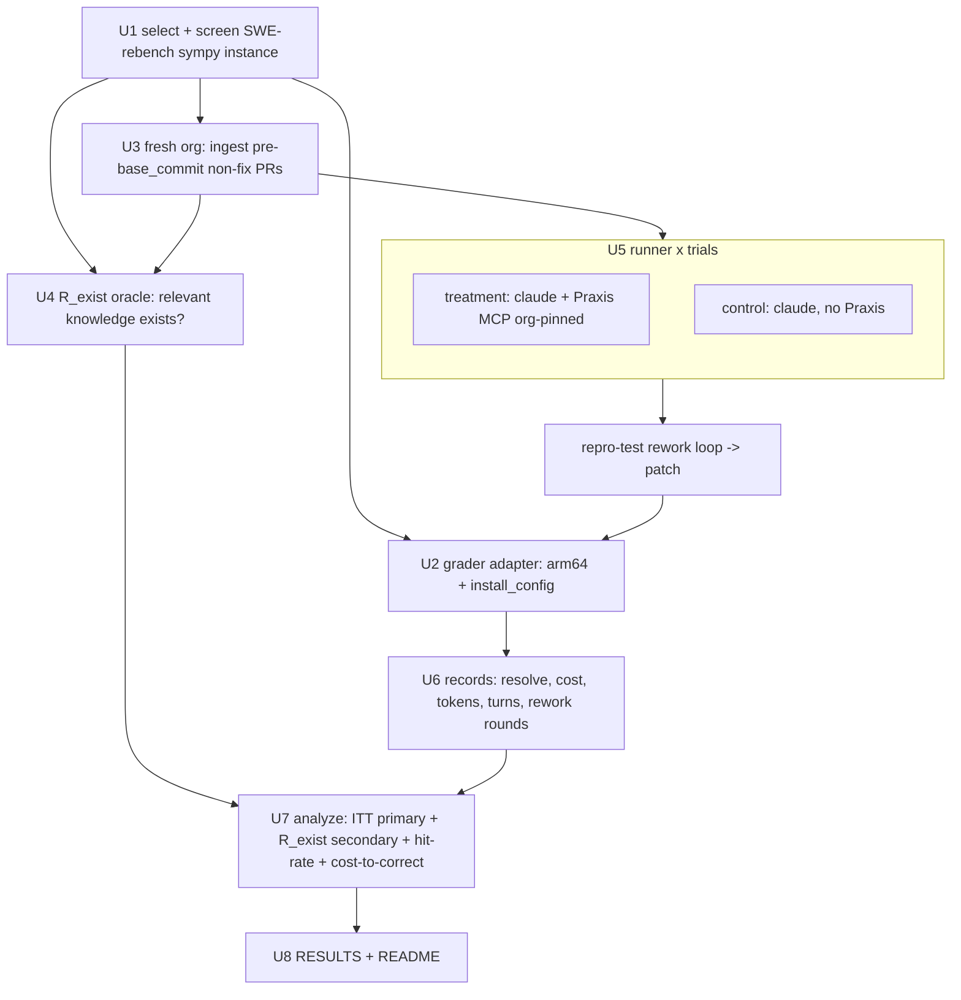

# feat: Praxis PR-knowledge eval pilot (SWE-rebench cost-to-correct A/B)

## Summary

Build a feasibility-and-instrumentation A/B harness that measures whether Praxis helps an agent fix real GitHub issues. For each instance in a recent SWE-rebench sympy slice, ingest the pre-`base_commit` non-fix PR window into a fresh per-instance Praxis org, run Sonnet to fix the issue with vs without Praxis (agentic MCP retrieval + a reproduction-test rework loop), grade with the WSL2 arm64 SWE-bench harness via a `install_config` adapter, and read out cost-to-correct as an unconditioned ITT effect plus a pre-treatment relevance-stratified secondary. The harness mirrors the existing `cases/dom/pr_knowledge_dogfood/analyze.py` cost-to-correct pattern (in-process orchestration + pure, offline-testable aggregate/gate), swapping the correctness oracle from deterministic footgun checks to the gold-test grader.

---

## Problem Frame

Praxis's application thesis is that knowledge distilled from a repo's development history makes a coding agent better and cheaper at fixing issues. The existing dogfood eval tests only a sealed-box, footgun-avoidance proxy (and is apparatus-limited NO-GO). This pilot tests the realistic version — an agent fixing an actual issue end to end — while three forces (contamination, low statistical power, and a near-replica prior system that returned null-on-aggregate) make it a *feasibility study*, not a quantitative verdict. Full motivation, the decontamination rationale, and the corrected (ITT + pre-treatment stratum) analysis live in the origin requirements doc (see origin).

All four mechanics are already de-risked on this machine via smoke tests: the arm64 grader (Verified gold → RESOLVED), `gh` PR-backfill → Praxis KG → retrieval, the agent→patch→grade loop, and the SWE-rebench grader via `install_config` injection. This plan productizes those drivers into a harness.

---

## Key Technical Decisions

- **New repo-mounted runner, not a `ClaudeCodeRunner` reuse.** The existing runner (`knowledge/evals/claude_code.py`) is a sealed box — no Bash, no repo mounted, no network — so its "fewer exploration turns" lever barely exists and it cannot run a repro test or reach Praxis. The pilot needs a new runner that mounts the checkout, runs the repo's own tests, and (treatment) reaches the MCP. We reuse its `_claude_usage` cost/turn capture and the `--append-system-prompt`/`--output-format json`/`ANTHROPIC_API_KEY`-scrub patterns, but not the execution model. (R8, R9)

- **Agent runs in a WSL checkout with an `install_config` venv; `claude` and the Praxis MCP stay on the host.** Smokes #2/#3 already proved host-side `claude` and host-side Praxis MCP. The only new piece is replicating the instance's environment in a venv from SWE-rebench's `install_config` (`install`, `pip_packages`, `python`) so the agent's *own* repro test runs. Gold grading still happens in the canonical container (fidelity preserved where it counts). Running the agent inside the SWE-bench container is the documented alternative (higher env fidelity, but per-instance `claude`+auth+MCP-in-container wiring); deferred unless env drift bites. (R8, R9)

- **Grader = the official swebench harness, arm64-patched, with per-instance `install_config` injection.** SWE-rebench instances are self-contained but the official harness mis-grades them (runs sympy's `bin/test` + `parse_log_sympy` instead of the instance's `pytest -rA` + `parse_log_pytest`). The validated fix (smoke #4): force `arch="arm64"` across the three `make_test_spec` import sites, override `MAP_REPO_VERSION_TO_SPECS[repo][version]["test_cmd"]` with the instance's `test_cmd`, and repoint `MAP_REPO_TO_PARSER[repo]` at `parse_log_pytest`. (R14)

- **Correctness oracle is the gold-test grader; the gate is ITT + `R_exist`, not footgun-flip.** Unlike the dogfood suite (deterministic footgun `correct_check`), correctness here is "the instance's `FAIL_TO_PASS` + `PASS_TO_PASS` pass under the grader." The analysis is the unconditioned ITT effect (all T vs all C) plus a pre-specified, exploratory secondary stratified on `R_exist`. The `docs/solutions/` footgun-validation convention does not apply (no hand-authored footguns). (R20, R22)

- **`R_exist` is a pre-treatment oracle, computed independent of the treatment arm.** For each instance, run an offline oracle retrieval over its org against the gold-changed file paths + issue text, and set `R_exist = 1` iff at least one fact clears Praxis's retrieval floor. Measuring relevance *before* and *independent of* whether retrieval fired in treatment is what keeps the secondary causally valid (avoids post-treatment collider conditioning). The hit-rate is itself a first-class output. (R21)

- **Cost accounting: cost-to-correct from agent cost only; ingestion amortized; retrieval overhead separated.** Cost-to-correct = cumulative *agent* cost to the first resolved attempt (mirrors dogfood, captures cache-read cost via `total_cost_usd`). Ingestion cost (server-side distillation) is recorded as a separate amortized line, never charged per-instance. Retrieval-operation overhead (query embedding + MCP round-trip) is tracked separately; retrieved-context tokens already live in agent cost and must not be double-counted. (R16, R17, R18, R19)

- **Per-instance org isolation; oldest-PR-first; fix-PR excluded; leakage-guarded.** Each instance gets a fresh org holding only PRs merged before its `base_commit`, ingested oldest-first as active facts, with the fix-PR (and any fix-restating PR) excluded and a guard that no ingested fact restates the gold diff. This makes the org a point-in-time snapshot, sidestepping the temporal-contradiction problem on the stock ingest path. (R4, R5, R6, R7)

- **Mirror dogfood's pure-function split for offline testability.** Orchestration calls the runner in-process and the grader directly; `aggregate`/`evaluate_gate` operate on plain dict records so the gate unit-tests offline against a committed records fixture — never through a CLI that would clobber `results/baseline.jsonl`. (R20)

---

## High-Level Technical Design

Per-instance pipeline (one fresh org per instance; trials reuse the org read-only):



The two arms share one policy (repro-test rework, same prompts, model fixed = Sonnet); the only difference is whether the Praxis MCP tool is present and org-pinned. The grader is the same install_config-adapted harness for both arms.

---

## Output Structure

New subpackage under the existing eval tree:

```text
knowledge/evals/swebench/
  __init__.py
  instances.py        # U1  select + screen SWE-rebench sympy instances
  grader.py           # U2  arm64 + install_config-injected swebench harness wrapper
  ingest.py           # U3  per-instance org + pre-base_commit non-fix PR ingest
  relevance.py        # U4  pre-treatment R_exist oracle
  runner.py           # U5  repo-mounted, MCP-connected agent runner + repro rework loop
  experiment.py       # U6  three-arm trial orchestration + cost records
  analyze.py          # U7  pure aggregate + ITT/R_exist gate
  run.py              # U8  end-to-end CLI
  instances.manifest.json   # committed chosen instance set (U1 output)
  RESULTS.md / RESULTS.data.json
  README.md           # validity notes
  tests/
    test_instances.py test_grader.py test_ingest.py
    test_relevance.py test_runner.py test_analyze.py
    fixtures/         # committed records + fake-fetcher PR JSON + sample logs
```

The per-unit `**Files:**` sections are authoritative; the tree is the expected shape.

---

## Implementation Units

### U1. SWE-rebench instance selection + leakage screening

- **Goal:** Produce a committed, screened set of ~10 recent SWE-rebench sympy instances to run the pilot against.
- **Requirements:** R1, R2, R3
- **Dependencies:** none
- **Files:** `knowledge/evals/swebench/instances.py`, `knowledge/evals/swebench/instances.manifest.json`, `knowledge/evals/swebench/tests/test_instances.py`
- **Approach:** Load `nebius/SWE-rebench` (HF `datasets`), filter `repo == "sympy/sympy"`, sort by `created_at` desc, keep versions present in the official `MAP_REPO_VERSION_TO_SPECS` (1.12–1.14). Screen each candidate for solution-in-issue leakage (the fix appearing in `problem_statement`) — a heuristic pass (changed-symbol / diff-line overlap with issue text) plus a recorded human-review flag per instance. Persist the chosen set (`instance_id`, `version`, `base_commit`, `created_at`, gold-changed file list, screen verdict) to the manifest so downstream units and reruns are deterministic.
- **Patterns to follow:** dataset loading shape from the smoke driver; manifest-as-committed-artifact mirrors `facts.insights.json` in the autodistill suite.
- **Test scenarios:**
  - Version filter keeps only map-covered versions; an instance with an unsupported version is excluded.
  - Leakage screen flags an instance whose `problem_statement` contains the changed symbol/diff lines; passes a clean one.
  - Manifest round-trips (write → read → identical chosen set); selection is stable given a fixed dataset snapshot.
  - `Covers R2.` screening records a verdict for every chosen instance (no silent inclusion).

### U2. SWE-rebench grader adapter (arm64 + install_config)

- **Goal:** A `grade(instance, patch) -> GradeResult` wrapper over the official swebench harness that builds + grades SWE-rebench instances correctly on arm64.
- **Requirements:** R14, R15
- **Dependencies:** U1
- **Files:** `knowledge/evals/swebench/grader.py`, `knowledge/evals/swebench/tests/test_grader.py`
- **Approach:** Productize smoke #4's driver. Apply the arch monkeypatch (`make_test_spec` → `arch="arm64"` rebound in `test_spec`, `docker_build`, `run_evaluation`). Before grading, inject the instance's `install_config`: override `MAP_REPO_VERSION_TO_SPECS["sympy/sympy"][version]["test_cmd"]` with the instance's `test_cmd` and repoint `MAP_REPO_TO_PARSER["sympy/sympy"]` at `parse_log_pytest` (grab via `MAP_REPO_TO_PARSER["pydata/xarray"]`; mutate the shared dict + `grading.MAP_REPO_TO_PARSER`). Run via `run_evaluation.main` with `predictions_path` = a written predictions file, `namespace=None`, `cache_level="env"`. Parse the per-instance `report.json` into `resolved` + per-test status. The harness is Linux-only and invoked through WSL; the wrapper shells into the WSL venv.
- **Execution note:** Start with a characterization test that asserts the spec/parser overrides are applied to the in-memory maps (pure, no Docker), since the Docker path can't run in CI.
- **Patterns to follow:** smoke driver `grade_rebench_arm.py`; the arch-patch + parser-override sequence is the load-bearing part.
- **Test scenarios:**
  - Override application: after `prepare(instance)`, `MAP_REPO_VERSION_TO_SPECS[...][version]["test_cmd"]` equals the instance's `test_cmd` and the sympy parser is `parse_log_pytest` (offline, asserts on the maps).
  - `report.json` parsing: a committed sample report with all `FAIL_TO_PASS`/`PASS_TO_PASS` passing → `resolved=True`; a sample with the target test failing → `resolved=False`.
  - Predictions-file shape: `model_patch` is written with LF endings and the instance id; an empty patch yields `resolved=False` without raising.
  - `Test expectation: live Docker grade is exercised by the smoke driver, not unit tests` — the unit layer covers map mutation + report parsing only.

### U3. Per-instance org ingest pipeline

- **Goal:** For one instance, create a fresh Praxis org and ingest the pre-`base_commit`, non-fix PR window as active facts, leakage-guarded.
- **Requirements:** R4, R5, R6, R7
- **Dependencies:** U1
- **Files:** `knowledge/evals/swebench/ingest.py`, `knowledge/evals/swebench/tests/test_ingest.py`
- **Approach:** Create org via `POST /orgs` (dev tenant); select the window of merged sympy PRs with `merged_at < base_commit` date, oldest-first, via a `-R sympy/sympy` fetcher wrapping `pr_source.default_fetcher`; exclude the instance's fix-PR and any PR whose diff/body restates the gold diff. For each PR, `build_pr_document(...).render()` → `POST /ingest` with `state="active"`, `source="git/pr:<n>"`, scoped to the org via `X-Praxis-Org`. Leakage guard: after ingest, query `GET /context` (or oracle retrieval) and fail loudly if any fact restates the gold diff. Record ingestion cost (response token/cost surfaced by the server, or a separate distillation-cost probe) for the amortized metrics line.
- **Patterns to follow:** the injected `Fetcher` seam in `pr_source.py`; the `/ingest` + `X-Praxis-Org` shapes proven in smoke #2; oldest-first ingestion so in-window contradictions resolve to the latest-as-of-`base_commit` value.
- **Test scenarios:**
  - Window selection excludes PRs merged at/after `base_commit` and excludes the fix-PR; ordering is oldest-first (offline, fake fetcher with dated PR list).
  - Fix-restating-PR exclusion: a PR whose diff matches the gold diff is dropped.
  - Leakage guard raises when a seeded fact restates the gold diff; passes otherwise.
  - `Covers R5.` two instances ingest into distinct orgs with no cross-instance fact bleed (org-scoped retrieval returns only own facts).
  - Ingestion-cost record is captured per instance for the amortized line.

### U4. Pre-treatment `R_exist` relevance oracle

- **Goal:** Decide, before treatment runs, whether relevant knowledge exists in an instance's org.
- **Requirements:** R21
- **Dependencies:** U1, U3
- **Files:** `knowledge/evals/swebench/relevance.py`, `knowledge/evals/swebench/tests/test_relevance.py`
- **Approach:** Build a query from the instance's gold-changed file paths + issue text; run oracle retrieval against the org (`GET /context` with the instance's org header, or a direct graph search) and set `R_exist=1` iff ≥1 hit clears Praxis's retrieval floor (the `RetrievingReader` absolute floor / relative-ratio cutoff). Return `R_exist` plus the top score and the hit that triggered it (for case studies). This is computed independent of whether the agent later queries Praxis.
- **Patterns to follow:** the retrieval floor in `knowledge/graph_reader/.../retrieving_reader.py`; reuse `GET /context` rather than reimplementing ranking.
- **Test scenarios:**
  - Org containing a fact about a gold-changed file → `R_exist=1`; empty/off-topic org → `R_exist=0` (offline against a seeded test org or stubbed retrieval).
  - Floor behavior: a hit just below the absolute floor does not set `R_exist`; just above does.
  - Determinism: same org + instance → same verdict and score across calls.

### U5. Repo-mounted agent runner with repro-test rework loop

- **Goal:** Run one arm (treatment or control) for one instance: produce an LF-normalized patch via the agent, with the reproduction-test rework loop, capturing cost/tokens/turns.
- **Requirements:** R8, R9, R10, R11, R12, R13
- **Dependencies:** U3
- **Files:** `knowledge/evals/swebench/runner.py`, `knowledge/evals/swebench/tests/test_runner.py`
- **Approach:** Check out sympy at `base_commit` (LF-preserving); build a venv from the instance's `install_config` (`python`, `install`, `pip_packages`) so the agent can run its own repro. Invoke host `claude` (`-p <prompt> --output-format json --model sonnet --max-turns N`, `acceptEdits` or repo-scoped tools incl. test execution) with cwd = checkout. Treatment additionally configures the Praxis MCP (`praxis_get_context`) pinned to the instance's org via the per-agent MCP cache/config; control omits it. The prompt instructs: write a failing repro test from the issue, then fix until it passes. On a graded failure (from U2), re-prompt up to K rounds with the full issue text + "still not resolved" + its repro — never the gold tests. Extract the patch with `git add --renormalize && git diff --cached` (LF), reuse `_claude_usage`-style parsing for `total_cost_usd`/`num_turns`/tokens, and track retrieval-operation overhead separately (treatment only).
- **Execution note:** Start with a failing test for patch-extraction LF-normalization (the smoke-#3 CRLF footgun) before wiring the live loop.
- **Patterns to follow:** `claude_code.py` cost capture + `ANTHROPIC_API_KEY` scrub + injected `run_cli` seam (keep the CLI injectable so seams test offline); MCP org-pinning per `knowledge/mcp/identity.py` per-agent cache.
- **Test scenarios:**
  - Patch extraction normalizes CRLF → LF and applies cleanly (the smoke-#3 regression), via a fake checkout with mixed endings.
  - Prompt assembly: rework prompt includes full issue text + repro, excludes any gold-test content (assert no `FAIL_TO_PASS` leakage into the prompt).
  - Arm config: treatment MCP config pins the instance org; control has no Praxis MCP entry.
  - Cost/turns parsed from a sample `--output-format json` payload; rework rounds counted and capped at K.
  - `Covers R13.` a failing first attempt triggers exactly one rework round when K=1; a passing first attempt triggers none.

### U6. Three-arm trial orchestration + cost records

- **Goal:** Per (instance, trial), run treatment + control + (on control failure) rework, grade each, and emit plain cost records.
- **Requirements:** R15, R16, R17, R18, R19, R20
- **Dependencies:** U2, U5
- **Files:** `knowledge/evals/swebench/experiment.py`, `knowledge/evals/swebench/tests/test_experiment.py`
- **Approach:** Mirror `dogfood/analyze.py`'s `run_experiment`/`_one` shape but with the grader as the oracle: run treatment arm (U5) → grade (U2) with rework loop; run control arm → grade; cost-to-correct = cumulative agent cost to first resolved attempt. Emit a record per (instance, trial, arm): `resolved`, `agent_cost`, `tokens`, `turns`, `rework_rounds`, plus instance-level `ingestion_cost` (amortized line) and treatment `retrieval_overhead`. Keep orchestration thin; all reduction lives in U7's pure functions. Call the runner/grader in-process; never the `knowledge.evals.run` CLI.
- **Patterns to follow:** `run_experiment`/`_one` (`dogfood/analyze.py`), `analyze_utils.measure`; guard against case-id/arm collisions (the autodistill bug) by keying records on `(instance_id, trial, arm)`.
- **Test scenarios:**
  - Record shape: a (instance, trial) yields treatment + control records; a failing control adds a rework cost to control's cost-to-correct, a passing control does not.
  - Cost-to-correct = control first-pass + rework when control's first attempt fails (asserted on stubbed arm results).
  - Ingestion cost is attached per instance once (not per trial); retrieval overhead only on treatment records.
  - Arm keying prevents collision: treatment and control records never overwrite each other.

### U7. Analysis — ITT primary + `R_exist` secondary + reporting

- **Goal:** Pure reduction of records into the pilot's readouts with honest uncertainty.
- **Requirements:** R20, R21, R22, and Success Criteria
- **Dependencies:** U6
- **Files:** `knowledge/evals/swebench/analyze.py`, `knowledge/evals/swebench/tests/test_analyze.py`, `knowledge/evals/swebench/tests/fixtures/records.sample.json`
- **Approach:** Pure `aggregate(records, rexist_map)` → ITT (all T vs all C: resolve-rate, mean cost-to-correct, with wide CIs and per-instance trial variance), the `R_exist=1`-stratified secondary (labeled exploratory), the `R_exist` hit-rate, and effectiveness-aware cost-per-resolved + average cost per instance. `evaluate_gate` encodes the Success Criteria (harness completed end-to-end; non-trivial hit-rate; promising directional ITT/secondary) and explicitly does **not** claim significance; a null ITT is an allowed outcome. Report ingestion cost as a separate amortized line. Functions operate on plain dicts → unit-test offline against the committed `records.sample.json`.
- **Patterns to follow:** the `aggregate`/`evaluate_gate` pure-function split + `--from-records` re-aggregation (`dogfood/analyze.py`); `mean_sd`/`rate` from `analyze_utils`.
- **Test scenarios:**
  - ITT computed over all records regardless of `R_exist`; CIs widen as trial count drops.
  - `R_exist` secondary restricted to `R_exist=1` instances; hit-rate reported separately.
  - Cost-to-correct and cost-per-resolved match hand-computed values on the sample fixture.
  - `evaluate_gate` returns "feasibility met" when harness-complete + non-trivial hit-rate + directional signal; a null ITT alone does not flip it to fail.
  - `--from-records` re-aggregates the committed sample without invoking agents or Docker.

### U8. End-to-end CLI + validity README

- **Goal:** A single entry point that runs selection → ingest → arms → grade → analyze, and a README documenting validity caveats.
- **Requirements:** all (integration); Dependencies/Assumptions from origin
- **Dependencies:** U1, U2, U3, U4, U5, U6, U7
- **Files:** `knowledge/evals/swebench/run.py`, `knowledge/evals/swebench/__init__.py`, `knowledge/evals/swebench/README.md`, `knowledge/evals/swebench/RESULTS.md`
- **Approach:** `uv run python -m knowledge.evals.swebench.run --instances N --trials K [--from-records FILE] [--out FILE]`. Orchestrate per the HTD; write `RESULTS.data.json` + a `RESULTS.md` narrative. README states the pilot's feasibility framing, the underpowering, the residual within-window contamination, the per-instance-org mechanism, and the install_config grader adaptation — so a reader doesn't over-read a null. Requires the Praxis backend up (dev tenant) and WSL2 Docker.
- **Patterns to follow:** `dogfood/analyze.py` argparse `main` + `--from-records`; `_ensure_repo_on_path` bootstrap before any `knowledge` import; `README.md`/`RESULTS.md` companion convention.
- **Test scenarios:**
  - `--from-records` path runs analysis-only without backend/Docker (smoke of the wiring).
  - CLI arg parsing: `--instances`/`--trials` propagate; missing backend yields a clear error, not a stack trace.
  - `Test expectation: full live run is manual (needs backend + WSL Docker), exercised end-to-end outside CI.`

---

## Scope Boundaries

### Deferred to Follow-Up Work
- The powered, confirmatory run (~130 instances/arm, likely a cloud x86 grader) — the pilot is explicitly underpowered.
- django and non-pure-Python repos (matplotlib, scikit-learn) — sympy-only until arm64 builds are confirmed elsewhere.
- The pre-injection delivery variant — built only if the agentic-retrieval result is null (origin's reserved diagnostic).
- In-container agent execution — documented alternative to U5's WSL-venv approach; revisit only if env drift causes false negatives.

### Outside this pilot's scope (origin scale-up levers)
- Option B: one org per repo with `valid_at` backdating + temporal-supersession reuse (requires ingest-path changes Praxis does not yet have).
- Strict post-cutoff (Feb–Jun 2026) freshly-mined instances — the pilot accepts SWE-rebench's within-window (≤2025-04) residual contamination.
- Multi-model comparison — pilot is Sonnet-only, model held fixed across arms.

---

## Risks & Dependencies

- **Grader is Linux/Docker-only and arm64-adapted.** Runs only through WSL2 + Docker Desktop (WSL integration enabled). The arch patch + install_config injection are load-bearing and version-specific (sympy 1.12–1.14 in the official map). Risk: a chosen instance's version drifts out of the map → U1 must filter it out.
- **Underpowered by design.** ~10 instances × 3 trials → ±20–30pp CIs. Mitigation: U7 reports wide CIs + per-instance variance and makes "feasibility met / null allowed" explicit; no significance claims.
- **Residual contamination.** SWE-rebench's snapshot ends 2025-04 (within the model's Jan-2026 cutoff). Mitigation: prefer newest instances; treat control as a reduced-but-nonzero memorization floor; strict decontamination deferred.
- **Relevance hit-rate may be low.** If `R_exist` is rarely 1, the secondary is thin — but the hit-rate is itself a primary deliverable (it answers "is the direction worth scaling?").
- **Backend + env dependencies.** Needs the Praxis backend up (dev tenant, per-instance orgs) and per-instance `install_config` venvs. The agent's repro env can drift from the grader's container env; low-stakes because the repro is a direction signal and gold grading happens in the canonical container.
- **`gh` rate/availability** for the pre-`base_commit` PR window fetch (sympy is public; diffs capped by `summarize_diff`).

---

## Alternatives Considered

- **Agent inside the SWE-bench container vs. WSL checkout + `install_config` venv (chosen).** In-container gives the agent the exact grader env (no drift) and reuses the built image, but needs `claude` installed per-instance-image, subscription auth threaded in, and the MCP reachable via `host.docker.internal`. The WSL-venv approach reuses host-side `claude`+MCP (already proven) and only replicates the env; chosen for pilot simplicity since the agent's env only needs to run its own repro test. Revisit if drift causes false negatives.
- **SWE-rebench's own runner vs. official harness + install_config injection (chosen).** SWE-rebench ships prebuilt x86 images and a runner, but the x86 images don't run natively on arm64 and the runner's arm64 story is unverified. The official harness already builds sympy 1.13 natively on arm64; injecting the instance's `install_config` (smoke #4) is the smaller, validated path.
- **Extend `ClaudeCodeRunner` vs. new runner (chose new).** The sealed-box model is structurally incompatible with mounting a repo, running tests, and reaching a network MCP. A new runner that borrows only the cost-capture seam is cleaner than bending the sealed box.

---

## Success Metrics

The harness, not the effect size, is the deliverable. The pilot meets its bar (justifies a powered scale-up) when, per origin Success Criteria: (1) the full ingest → two-arm → rework → grade → analyze loop completes on the SWE-rebench arm64 substrate; (2) the `R_exist` hit-rate is non-trivial; and (3) the directional ITT and `R_exist=1` estimates plus hard-case case studies are promising enough to motivate a ~130-instance/arm confirmatory run. A null ITT is an expected, acceptable outcome — the decision rests on hit-rate + directional hard-case signal, not aggregate significance.

---

## Sources & Research

- Origin requirements: `docs/brainstorms/2026-06-26-praxis-pr-knowledge-eval-pilot-requirements.md` (full research synthesis — CommitDistill null, post-treatment conditioning bias, power/variance, contamination/leakage, agent-authored repro, context-quality effects, cost metrics).
- Pattern to mirror: `knowledge/evals/cases/dom/pr_knowledge_dogfood/analyze.py` (three-arm cost-to-correct, pure `aggregate`/`evaluate_gate`, `--from-records`); `knowledge/evals/analyze_utils.py` (cost/turns/measure primitives).
- Runner to borrow from: `knowledge/evals/claude_code.py` (`_claude_usage` cost capture, `--append-system-prompt` injection, `ANTHROPIC_API_KEY` scrub, injected `run_cli`).
- Ingestion + service path: `knowledge/injestion/pr_source.py` (`build_pr_document`, `list_merged_prs`, injected `Fetcher`); `knowledge/serve/app.py` `POST /ingest` (`:1340`), `GET /context` (`:1567`); org auth via `X-Praxis-Org` (`active_org`, `:329`).
- Retrieval floor for `R_exist`: `knowledge/graph_reader/grapher_reader_variants/retrieving_reader.py`.
- Convention: `docs/solutions/conventions/gate-eval-experiment-plans-on-validated-footguns.md` (carry forward only validated constructs; our oracle is the gold-test grader, so footgun validation does not gate this pilot).
- Validated smoke drivers (scratchpad): grader (`grade_rebench_arm.py`, install_config injection), ingest (`smoke2_sympy_ingest.py`), agent loop (`run_agent.sh` + `grade_pred_arm.py`).
